# LoRaMesher Protocol Specification

**Version**: 1.6
**Last Updated**: 2026-03-12
**Protocol Type**: Distance-Vector Mesh Routing with Power-Aware TDMA and Sponsor-Based Joining

This document provides the complete technical specification for the LoRaMesher protocol, a distance-vector routing protocol designed for LoRa mesh networks with TDMA coordination. Version 1.2 introduces sponsor-based join mechanisms and enhanced routing table architecture. Version 1.2.1 synchronizes documentation with actual implementation and moves unimplemented features to the Future Work section. Version 1.2.2 adds discovery timeout jitter to prevent race conditions when multiple nodes start simultaneously.

## Table of Contents

1. [Protocol Overview](#1-protocol-overview)
   - 1.1 [Design Principles](#11-design-principles)
   - 1.2 [Network Architecture](#12-network-architecture)
   - 1.3 [Protocol Stack](#13-protocol-stack)
2. [State Machine Specification](#2-state-machine-specification)
   - 2.1 [Protocol States](#21-protocol-states)
   - 2.2 [State Descriptions](#22-state-descriptions)
   - 2.3 [State Transition Triggers](#23-state-transition-triggers)
3. [Message Format Specification](#3-message-format-specification)
   - 3.1 [Message Type Organization](#31-message-type-organization)
   - 3.2 [Core Message Types](#32-core-message-types)
   - 3.3 [Message Serialization](#33-message-serialization)
4. [Routing Algorithm](#4-routing-algorithm)
   - 4.1 [Distance-Vector Algorithm](#41-distance-vector-algorithm)
   - 4.2 [Loop Prevention](#42-loop-prevention)
   - 4.3 [Route Aging](#43-route-aging)
   - 4.4 [Network Topology Examples](#44-network-topology-examples-and-routing-behavior)
   - 4.5 [Routing Table Architecture](#45-routing-table-architecture)
5. [Network Synchronization (TDMA)](#5-network-synchronization-tdma)
   - 5.1 [Superframe Structure](#51-superframe-structure)
   - 5.2 [Timing Parameters](#52-timing-parameters)
   - 5.3 [Synchronization Protocol](#53-synchronization-protocol)
   - 5.4 [Slot Allocation](#54-slot-allocation)
   - 5.5 [Multi-Hop Synchronization Strategy](#55-multi-hop-synchronization-strategy)
   - 5.6 [Control Slot Allocation Strategy](#56-control-slot-allocation-strategy)
   - 5.7 [TX Guard Time Mechanism](#57-tx-guard-time-mechanism)
   - 5.8 [Power-Aware Slot Allocation](#58-power-aware-slot-allocation)
   - 5.9 [Network Manager Election Sequence](#59-network-manager-election-sequence)
   - 5.10 [Application Data Slot Timing API](#510-application-data-slot-timing-api)
6. [Network Discovery & Joining](#6-network-discovery--joining)
   - 6.1 [Network Discovery Process](#61-network-discovery-process)
   - 6.2 [Discovery Messages](#62-discovery-messages)
   - 6.3 [Join Process](#63-join-process)
   - 6.4 [Sponsor-Based Join Protocol](#64-sponsor-based-join-protocol)
   - 6.5 [Network Merging](#65-network-merging)
7. [Packet Structure](#7-packet-structure)
   - 7.1 [Physical Layer Frame](#71-physical-layer-frame)
   - 7.2 [LoRaMesher Frame Structure](#72-loramesher-frame-structure)
   - 7.3 [Header Field Descriptions](#73-header-field-descriptions)
   - 7.4 [Maximum Frame Sizes](#74-maximum-frame-sizes)
8. [Error Handling](#8-error-handling)
   - 8.1 [Error Classification](#81-error-classification)
   - 8.2 [Error Recovery Mechanisms](#82-error-recovery-mechanisms)
9. [Performance Characteristics](#9-performance-characteristics)
   - 9.1 [Timing Requirements](#91-timing-requirements)
   - 9.2 [Scalability Limits](#92-scalability-limits)
   - 9.3 [LoRa Air Time Calculations](#93-lora-air-time-calculations)
   - 9.4 [Memory Usage](#94-memory-usage)
10. [Future Work and Research Directions](#10-future-work-and-research-directions)
    - 10.1 [Open Research Questions](#101-open-research-questions)
    - 10.2 [Implementation and Testing Requirements](#102-implementation-and-testing-requirements)
    - 10.3 [System Architecture Evolution](#103-system-architecture-evolution)
    - 10.4 [Protocol Extensions](#104-protocol-extensions)
    - 10.5 [Performance Optimization](#105-performance-optimization)
    - 10.6 [Planned Message Types and Protocols](#106-planned-message-types-and-protocols)
11. [Conclusion](#11-conclusion)

---

## 1. Protocol Overview

### 1.1 Design Principles

LoRaMesher is designed around these core principles:

- **Distance-Vector Routing**: Each node maintains routing tables with hop counts and link quality metrics
- **TDMA Coordination**: Time-division multiple access prevents collisions and enables network synchronization
- **Service-Oriented Architecture**: Protocol functionality is separated into distinct services
- **Hierarchical Network Management**: Special network manager nodes coordinate timing and topology
- **Adaptive Link Quality**: Multiple metrics determine optimal routing paths

### 1.2 Network Architecture

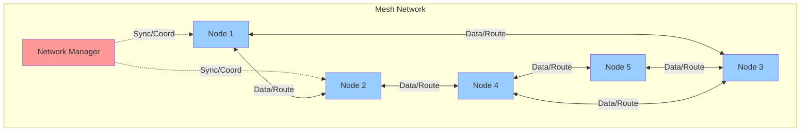

### 1.3 Protocol Stack

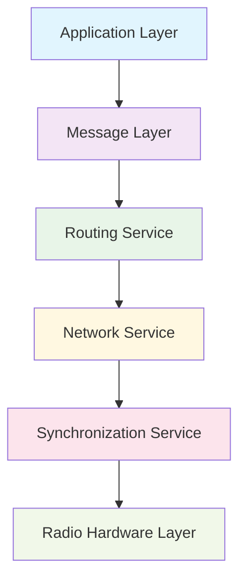

---

## 2. State Machine Specification

### 2.1 Protocol States

The LoRaMesher protocol operates in six distinct states:

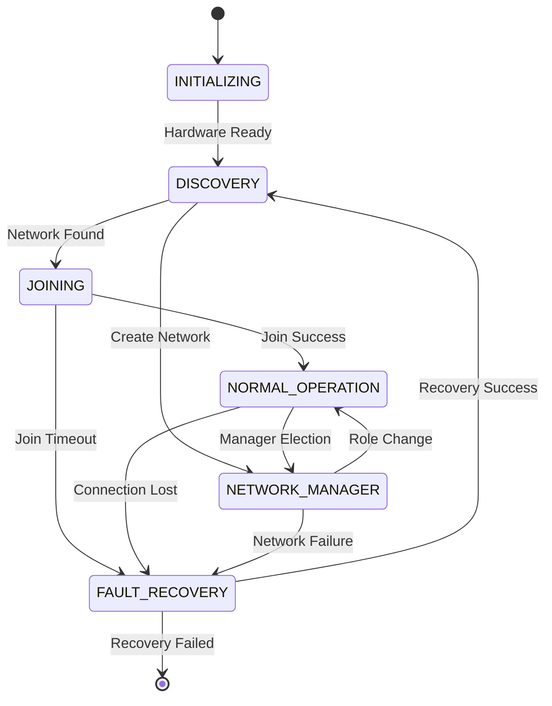

### 2.2 State Descriptions

#### INITIALIZING
- **Purpose**: System startup and hardware configuration
- **Duration**: 1-5 seconds
- **Activities**: 
  - Initialize radio hardware
  - Load configuration parameters
  - Start protocol services
- **Transitions**: 
  - Success → `DISCOVERY`
  - Failure → Protocol termination

#### DISCOVERY
- **Purpose**: Find existing networks or create new one
- **Duration**: 10-30 seconds (configurable)
- **Activities**:
  - Listen for network beacons
  - Broadcast discovery messages
  - Evaluate network options
- **Transitions**:
  - Network found → `JOINING`
  - Timeout with no networks → `NETWORK_MANAGER`
  - Critical error → `FAULT_RECOVERY`

#### JOINING
- **Purpose**: Connect to discovered network
- **Duration**: 5-15 seconds
- **Activities**:
  - Send join request to network manager
  - Negotiate slot assignment
  - Synchronize with network timing
- **Transitions**:
  - Join successful → `NORMAL_OPERATION`
  - Join failed/timeout → `FAULT_RECOVERY`

#### NORMAL_OPERATION
- **Purpose**: Standard data communication and routing
- **Duration**: Indefinite
- **Activities**:
  - Process and forward data messages
  - Maintain routing tables
  - Participate in network synchronization
- **Transitions**:
  - Elected as manager → `NETWORK_MANAGER`
  - Connection loss → `FAULT_RECOVERY`

#### NETWORK_MANAGER
- **Purpose**: Coordinate network timing and topology
- **Duration**: Indefinite
- **Activities**:
  - Broadcast synchronization beacons
  - Manage slot allocations
  - Handle join requests
  - Coordinate routing updates
- **Transitions**:
  - Role transferred → `NORMAL_OPERATION`
  - Network failure → `FAULT_RECOVERY`

#### FAULT_RECOVERY
- **Purpose**: Handle connection loss and network failures
- **Duration**: 30-60 seconds
- **Activities**:
  - Attempt to reconnect to known networks
  - Clear stale routing information
  - Reset synchronization state
- **Transitions**:
  - Recovery successful → `DISCOVERY`
  - Election backoff expires → `NM_ELECTION`
  - Recovery failed → Protocol termination

#### NM_ELECTION
- **Purpose**: Election backoff expired; node has broadcast NM_CLAIM and is waiting for counter-claims before calling CreateNetwork().
- **Transitions**:
  - → `NETWORK_MANAGER` : timeout (2 × slot_duration) expires with no higher-priority claim received
  - → `DISCOVERY` : higher-priority NM_CLAIM received; surrender and seek to join winner

### 2.3 State Transition Triggers

| From State | To State | Trigger | Condition |
|------------|----------|---------|-----------|
| INITIALIZING | DISCOVERY | Hardware Ready | Radio initialized successfully |
| DISCOVERY | JOINING | Network Found | Valid beacon received |
| DISCOVERY | NETWORK_MANAGER | Timeout | No networks found after timeout |
| JOINING | NORMAL_OPERATION | Join Success | JOIN_RESPONSE received |
| JOINING | FAULT_RECOVERY | Join Timeout | No response to JOIN_REQUEST |
| NORMAL_OPERATION | NETWORK_MANAGER | Manager Election | Current manager lost |
| NORMAL_OPERATION | FAULT_RECOVERY | Connection Lost | No valid messages for timeout period |
| NETWORK_MANAGER | NORMAL_OPERATION | Role Change | Another node elected manager |
| FAULT_RECOVERY | DISCOVERY | Recovery Success | Ready to rejoin network |

---

## 3. Message Format Specification

### 3.1 Message Type Organization

Messages use a bit-field organization for systematic categorization and efficient parsing:

#### 3.1.1 Bit-Field Structure

```cpp
/**
 * Message Type Organization (8-bit field):
 * - Bits 7-4 (high nibble): Main message category
 * - Bits 3-0 (low nibble): Subtype within the category
 *
 * This allows for 16 main categories with 16 subtypes each = 256 possible message types
 */
enum class MessageType : uint8_t {
    // Main categories (high nibble)
    DATA_MSG = 0x10,     // 0001 xxxx: Data message category
    CONTROL_MSG = 0x20,  // 0010 xxxx: Control message category
    ROUTING_MSG = 0x30,  // 0011 xxxx: Routing message category
    SYSTEM_MSG = 0x40,   // 0100 xxxx: System message category

    // Complete message types with categories + subtypes
    // Data messages (0x1x)
    DATA = 0x11,         // 0001 0001: Regular data message

    // Control messages (0x2x)
    ACK = 0x21,          // 0010 0001: Acknowledgment (reserved, not currently used)
    PING = 0x23,         // 0010 0011: Ping request
    PONG = 0x24,         // 0010 0100: Pong response

    // Routing messages (0x3x)
    HELLO = 0x31,        // 0011 0001: Hello packet (reserved, not currently used)
    ROUTE_TABLE = 0x32,  // 0011 0010: Routing table update

    // System messages (0x4x)
    SYNC = 0x41,         // 0100 0001: Synchronization packet
    JOIN_REQUEST = 0x42, // 0100 0010: Request to join network
    JOIN_RESPONSE = 0x43,// 0100 0011: Response to join request
    SLOT_REQUEST = 0x44, // 0100 0100: Request slot allocation
    SLOT_ALLOCATION = 0x45, // 0100 0101: Slot allocation response
    SYNC_BEACON = 0x46,  // 0100 0110: Multi-hop sync beacon
    NM_CLAIM = 0x47,     // 0100 0111: Broadcast during NM election to claim the Network Manager role
};
```

#### 3.1.2 Category Benefits

**Efficient Parsing**: Nodes can quickly determine message category using bit masking:
```cpp
MessageType main_type = static_cast<MessageType>(message_type & 0xF0);
if (main_type == MessageType::SYSTEM_MSG) {
    // Handle system message
}
```

**Systematic Extension**: New message types can be added systematically within existing categories or by creating new categories.

**Protocol Evolution**: The 4+4 bit structure provides room for 240+ additional message types while maintaining backward compatibility.

### 3.2 Core Message Types

#### 3.2.1 Join Messages
```cpp
// Join process messages with sponsor support
JOIN_REQUEST  = 0x42,  // Request to join network (with sponsor support)
JOIN_RESPONSE = 0x43,  // Response to join request (with routing semantics)
```

**JOIN_REQUEST Format**:
```cpp
struct JoinRequestHeader {
    // Standard message header (6 bytes)
    AddressType destination;        // Network Manager or next hop (2 bytes)
    AddressType source;             // Requesting node address (2 bytes)
    MessageType type = JOIN_REQUEST; // Message type 0x42 (1 byte)
    uint8_t payload_size;           // Size of join request payload (1 byte)

    // Join request specific fields (7 bytes)
    uint8_t battery_level;          // Battery level 0-100% (1 byte)
    uint8_t requested_slots;        // Number of data slots requested (1 byte)
    AddressType next_hop;           // Next hop for message forwarding (2 bytes)
    AddressType sponsor_address;    // Sponsor node address (0 = no sponsor) (2 bytes)
    uint8_t hop_count;              // Hops from joining node (incremented on forward) (1 byte)
};
```

**JOIN_RESPONSE Format**:
```cpp
struct JoinResponseHeader {
    // Standard message header (6 bytes)
    AddressType destination;         // Sponsor address (immediate routing) (2 bytes)
    AddressType source;              // Network Manager address (2 bytes)
    MessageType type = JOIN_RESPONSE; // Message type 0x43 (1 byte)
    uint8_t payload_size;            // Size of response payload (1 byte)

    // Join response specific fields (9 bytes)
    uint16_t network_id;             // Network identifier (2 bytes)
    uint8_t allocated_slots;         // Number of allocated data slots (1 byte)
    ResponseStatus status;           // Response status code (1 byte)
    AddressType next_hop;            // Next hop for message forwarding (2 bytes)
    AddressType target_address;      // Final recipient (joining node) (2 bytes)
    uint8_t control_slot_index;      // Assigned control slot index (1 byte) [v1.3]

    // Optional superframe info in payload
};
```

**Control Slot Index**:
The Network Manager assigns each joining node a unique `control_slot_index` tracked in-memory in the NM's routing table:
- NM itself has `control_slot_index = 0`
- New joining nodes get the **lowest available** index not currently assigned
- **Re-joining nodes** reuse their previously assigned index (looked up from NM's routing table)
- Departed nodes' indices are recycled for future joiners
- Value `0xFF` indicates unassigned (used for non-ACCEPTED responses)

This ensures collision-free CONTROL slot allocation, prevents index inflation on re-join, and recycles indices from departed nodes. Each node's CONTROL_TX slot position is: `sync_beacon_slots + control_slot_index`.

**JOIN_RESPONSE Status Codes**:
- `ACCEPTED = 0x00`: Join request accepted, slot allocated
- `REJECTED = 0x01`: Join request rejected due to constraints
- `CAPACITY_EXCEEDED = 0x02`: Network at capacity
- `AUTHENTICATION_FAILED = 0x03`: Authentication failed
- `RETRY_LATER = 0x04`: Temporarily rejected, retry after delay
- `RESERVED = 0x05`: Reserved for future use

**Key v1.2 Routing Semantics**:
- **destination**: Immediate next hop for message routing
- **target_address**: Final recipient for end-to-end delivery
- **sponsor_address**: Intermediate node facilitating join for nodes beyond Network Manager range

**Sponsor-Based Join Flow**:
1. Joining node selects sponsor (first sync beacon sender)
2. JOIN_REQUEST routed via sponsor to Network Manager
3. Network Manager sends JOIN_RESPONSE to sponsor with target_address=joining_node
4. Sponsor forwards response to final target (joining node)

#### 3.2.2 Routing Messages
```cpp
// Routing protocol messages
HELLO = 0x31,        // Hello packet (reserved, not currently implemented)
ROUTE_TABLE = 0x32,  // Routing table exchange (implemented)
```

**HELLO Message** *(Planned - see Section 10 Future Work)*:

The HELLO message type (0x31) is reserved for future neighbor discovery and link quality assessment functionality. The message type is defined in the enum but the HelloMessage struct is not yet implemented.

**Usage**:
- **ROUTE_TABLE messages**: Used for distance-vector routing table exchange (see section 3.3.3)

#### 3.2.3 Routing Table Messages
```cpp
// Routing table exchange messages
ROUTE_TABLE = 0x32,  // Distance-vector routing table exchange
```

**ROUTING_TABLE Format**:
```cpp
struct RoutingTableHeader {
    // Standard message header (6 bytes)
    AddressType destination;         // Target for routing table (2 bytes)
    AddressType source;              // Node sending table (2 bytes)
    MessageType type = ROUTE_TABLE; // Message type 0x32 (1 byte)
    uint8_t payload_size;            // Size of routing entries payload (1 byte)

    // Routing table specific fields (6 bytes)
    AddressType network_manager;     // Network Manager address (2 bytes)
    uint8_t table_version;           // Version for change detection (1 byte)
    uint8_t entry_count;             // Number of entries in message (1 byte)
    uint8_t source_capabilities;     // Source node capability flags (1 byte)
    uint8_t source_allocated_slots;  // Source node's allocated data slots (1 byte)
};

struct RoutingTableEntry {
    AddressType destination;         // Route destination (2 bytes)
    uint8_t hop_count;               // Hops to destination (1 byte)
    uint8_t link_quality;            // Combined route quality metric 0-255 (1 byte)
    uint8_t allocated_data_slots;    // Data slots for this node (1 byte)
    uint8_t capabilities;            // Node capability flags (1 byte)
    uint8_t control_slot_index;      // Assigned control slot, 0xFF=unassigned (1 byte)
    uint8_t reception_quality;       // Sender's raw EWMA reception quality (1 byte)
    AddressType next_hop;            // Sender's next_hop for loop prevention (2 bytes)
};
```

**Routing Table Message Benefits**:
- **Versioned Updates**: Table version enables efficient change detection
- **Modular Architecture**: Clean separation from legacy ROUTING_UPDATE format
- **Bidirectional Link Quality**: Separate `link_quality` (route cost) and `reception_quality` (raw EWMA) fields prevent circular feedback in quality estimation
- **Compact Format**: 10 bytes per route entry (max 24 entries per message)
- **Loop Prevention**: `next_hop` field enables receiver-side split horizon on broadcast updates

**Usage in Distance-Vector Protocol**:
1. Each node broadcasts routing table during CONTROL_TX slots
2. Version increments enable delta updates and loop detection
3. Link quality metrics prepare for future advanced routing algorithms
4. Entry count allows variable-length route advertisements

**Capability Propagation**:

Node capabilities (e.g., GATEWAY, custom flags) are propagated through the network using a **next-hop-based trust model**:

```cpp
// Capability update rule:
// Only accept capability updates from the next hop on the optimal path
if (routing_entry.capabilities == 0 && new_capabilities != 0) {
    // Always accept if current capabilities unknown
    update_capabilities();
} else if (next_hop == message_source && new_capabilities != 0) {
    // Trust capabilities only from our next hop to this destination
    update_capabilities();
}
```

**Benefits of Next-Hop Verification**:
- **Loop Prevention**: Stale capability information from non-optimal paths is rejected
- **Automatic Convergence**: When routes change, capability sources automatically update
- **Multi-hop Propagation**: Capabilities propagate through chains via optimal paths
- **No Extra State**: Leverages existing `next_hop` field in routing table
- **Trust Optimal Path**: Only information from best route is considered authoritative

**Example Capability Propagation**:
```
Network: Node1 ← Node2 ← Node3 (chain topology)
Node1 capabilities = GATEWAY (0x01)

1. Node2 receives routing table from Node1:
   - Node1: hop=1, caps=0x01 (direct neighbor)
   - Node2's next hop to Node1: Node1 ✓
   - Accept: Node2 stores caps=0x01

2. Node3 receives routing table from Node2:
   - Node1: hop=2, caps=0x01 (via Node2)
   - Node3's next hop to Node1: Node2 ✓
   - Accept: Node3 stores caps=0x01

3. Stale update: Node2 receives old info from Node3:
   - Node1: caps=0x00 (outdated)
   - Node2's next hop to Node1: Node1 (not Node3!) ✗
   - Reject: Node2 keeps caps=0x01
```

#### 3.2.4 Synchronization Messages
```cpp
// Network synchronization messages
SYNC_BEACON = 0x46,  // Multi-hop synchronization beacon
```

**SYNC_BEACON Format (Optimized)**:

*Message Size*: 20 bytes total (6-byte base header + 14-byte sync fields)
- **Optimization**: Reduced from 31 bytes (35% size reduction)
- **Power Impact**: Lower transmission time and energy consumption

```cpp
struct SyncBeaconHeader {
    // Standard message header (6 bytes)
    AddressType destination = 0xFFFF;    // Broadcast to all nodes (2 bytes)
    AddressType source;                  // Current transmitter address (2 bytes)
    MessageType type = SYNC_BEACON;      // Message type 0x46 (1 byte)
    uint8_t payload_size = 0;            // No payload data (1 byte)

    // Core synchronization fields (7 bytes)
    uint16_t network_id;                 // Network identifier (2 bytes)
    uint8_t total_slots;                 // Slots in complete superframe (1 byte)
    uint16_t slot_duration_ms;           // Individual slot duration (2 bytes) [OPTIMIZED: was 4 bytes]
    AddressType network_manager;         // Network Manager address (2 bytes)

    // Multi-hop forwarding fields (6 bytes)
    uint8_t hop_count;                   // Hops from Network Manager (1 byte)
    uint32_t propagation_delay_ms;       // Accumulated forwarding delay (4 bytes)
    uint8_t max_hops;                    // Network diameter limit (1 byte)

    // Network topology field (1 byte) [v1.4]
    uint8_t node_count;                  // Active nodes in network (1 byte)
};

// Calculated fields (not transmitted):
// - superframe_duration_ms = total_slots * slot_duration_ms
```

**Node Count**: The `node_count` field carries the Network Manager's authoritative count of control slots needed. All nodes use this value to determine `allocated_control_slots` in their slot frame, replacing the previous independent computation `max(routing_table.size(), my_control_slot_index + 1)`. This ensures all nodes agree on the slot frame structure regardless of their routing table view. The NM computes this as `max_assigned_control_slot_index + 1`.

#### 3.2.5 NM Election Messages
```cpp
// Network Manager election messages
NM_CLAIM = 0x47,  // Broadcast during NM election to claim the Network Manager role
```

**NM_CLAIM payload** (5 bytes after BaseHeader):
```cpp
struct NMClaimPayload {
    uint8_t  election_priority;    // lower = higher priority
    uint8_t  battery_level;        // 0–100 %
    uint8_t  network_node_count;   // nodes claimant knows
    uint16_t network_id;           // stable network identifier
};
```

See Section 5.9 for the full election algorithm.

#### 3.2.6 Data Messages
```cpp
// Implemented data messages
DATA = 0x11,            // Regular data message (point-to-point)
DATA_BROADCAST = 0x12,  // Network-wide broadcast (TTL-based flooding)

// Reserved for future implementation (see Section 10):
// DATA_MULTICAST = 0x13,  // Group communication
```

**DATA Message Wire Format** (10 bytes header + payload):
```
BaseHeader (6 bytes):
  destination     (2 bytes) - Final destination address
  source          (2 bytes) - Original sender address
  type            (1 byte)  - 0x11
  payload_size    (1 byte)  - Size of extension + user data

DataHeader Extension (4 bytes):
  next_hop        (2 bytes) - Immediate next hop for routing
  ttl             (1 byte)  - Time-to-live (decremented at each hop, default = 2 × max_hops)
  seq_num         (1 byte)  - Per-source sequence number for de-duplication

User payload: up to 251 bytes (255 max payload - 4 extension bytes)
```

**DATA_BROADCAST Message Wire Format** (same structure as DATA):
```
BaseHeader (6 bytes):
  destination     = 0xFFFF (broadcast address)
  source          (2 bytes) - Original sender address
  type            = 0x12
  payload_size    (1 byte)  - Size of extension + user data

Extension (4 bytes):
  next_hop        = 0xFFFF (broadcast, received by all neighbors)
  ttl             (1 byte)  - Time-to-live (default 10)
  seq_num         (1 byte)  - Per-source sequence number for de-duplication

User payload: up to 251 bytes
```

**Broadcast Behavior**:
- Each receiving node delivers to the application layer AND re-broadcasts with TTL-1
- De-duplication: 32-entry circular cache keyed on `(source, seq_num)` prevents duplicate delivery
- A single per-node sequence counter is shared by `SendData()` and `SendBroadcast()`
- Messages with TTL ≤ 1 are delivered but not forwarded

**Loop Prevention** (applies to both DATA and DATA_BROADCAST):
- TTL prevents infinite forwarding loops during routing convergence
- Sequence number + de-duplication cache detects messages already seen
- Own messages heard back are silently dropped (source == self check)

### 3.3 Message Serialization

All messages use little-endian byte order and are serialized using the following process:

1. **Header Creation**: Message type and routing information
2. **Payload Serialization**: Application data with length prefix
3. **Checksum Calculation**: Simple XOR checksum of all bytes
4. **Size Validation**: Ensure total size ≤ 255 bytes (LoRa constraint)

---

## 4. Routing Algorithm

### 4.0 Routing Update Propagation Sequence

The following diagram shows how routing updates propagate through the network:

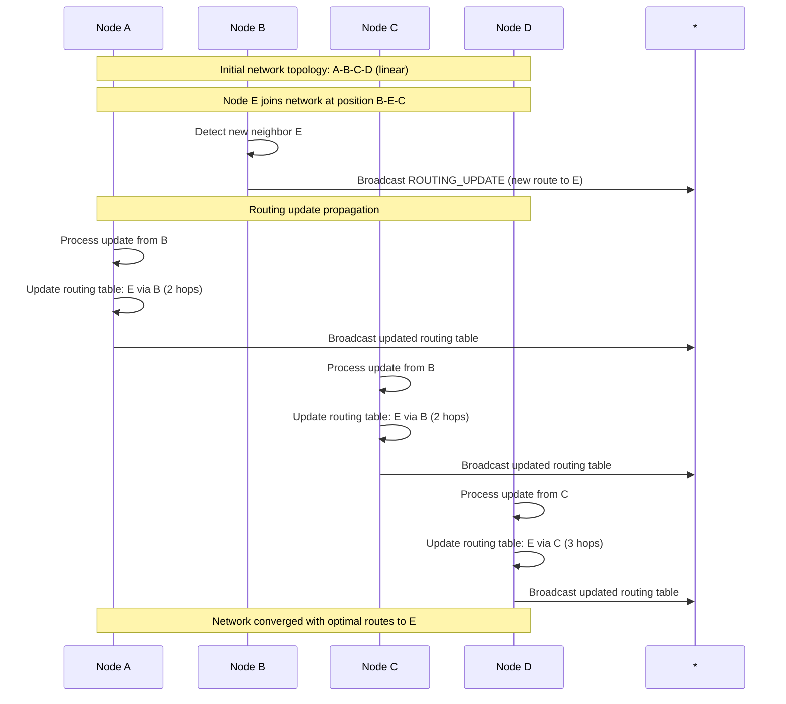

### 4.0.1 Data Message Multi-Hop Forwarding

This diagram illustrates how data messages are forwarded through multiple hops:

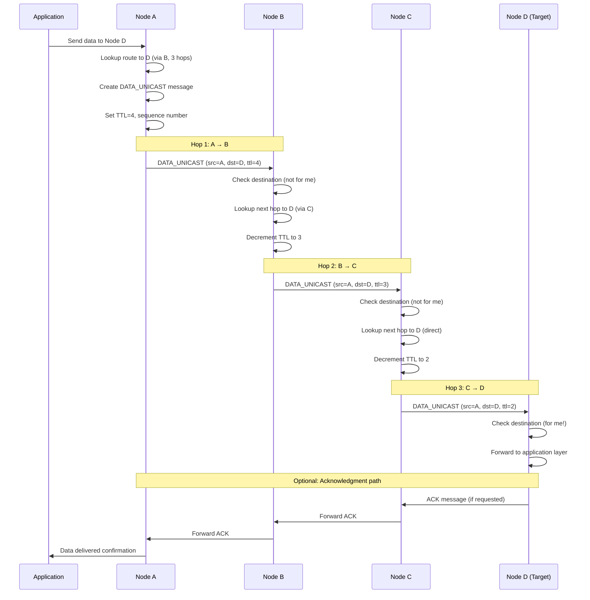

### 4.1 Distance-Vector Algorithm

LoRaMesher implements a modified Bellman-Ford distance-vector routing algorithm optimized for wireless mesh networks.

#### 4.1.1 Routing Table Structure

The implementation uses a two-layer structure for routing information:

**RoutingTableEntry** (for serialization/transmission):
```cpp
// From types/messages/loramesher/routing_table_entry.hpp
struct RoutingTableEntry {
    AddressType destination = 0;      // Destination address (uint16_t)
    uint8_t hop_count = 0;            // Hop count to destination
    uint8_t link_quality = 0;         // Combined route quality metric (0-255)
    uint8_t allocated_data_slots = 0; // Data slots allocated to node
    uint8_t capabilities = 0;         // Node capabilities bitmap
    uint8_t control_slot_index = 0xFF;// Assigned control slot (0xFF = unassigned)
    uint8_t reception_quality = 0;    // Sender's raw EWMA reception quality (0-255)
};
```

**NetworkNodeRoute** (internal routing table):
```cpp
// From types/protocols/lora_mesh/network_node_route.hpp
class NetworkNodeRoute {
    RoutingTableEntry routing_entry;  // Route metrics
    AddressType next_hop = 0;         // Next hop address
    uint32_t last_updated = 0;        // Timestamp of last update
    bool is_active = true;            // Route validity flag
    bool is_network_manager = false;  // Network manager flag
};
```

#### 4.1.2 Route Calculation

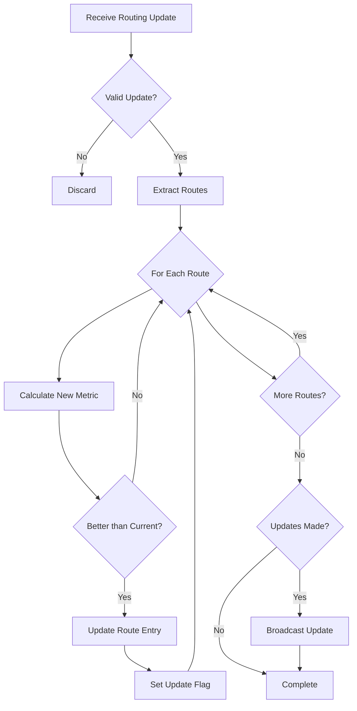

#### 4.1.3 Metric Calculation

**Primary Metric - Hop Count**:
```cpp
uint8_t newHops = receivedHops + 1;
if (newHops > MAX_HOPS) {
    // Route invalid due to hop limit
    return INVALID_ROUTE;
}
```

**Secondary Metric - Link Quality**:

Direct neighbor quality is calculated from the bottleneck direction of the bidirectional link:

```cpp
uint8_t local_quality = window.IsReady() ? window.GetPDR() : ewma_quality;

if (remote_link_quality > 0) {
    // Bidirectional: weighted bottleneck (70% min + 30% average)
    uint16_t bottleneck = std::min(local_quality, remote_link_quality);
    uint16_t average = (local_quality + remote_link_quality) / 2;
    return (bottleneck * 7 + average * 3) / 10;
}

if (messages_expected >= 3) {
    // Confirmed unidirectional: link cannot carry data
    return 1;  // Minimum quality (cost=65535)
}

return local_quality;  // Not enough data yet
```

When `localLinkQuality == 0` (peer doesn't list us), the unidirectional link detection mechanism in Section 4.3 applies. After confirmation (3+ expected messages with no remote acknowledgment), quality is set to **1** (minimum) — a link that cannot carry unicast data has maximum ETX cost (65535). This causes the ETX cost comparison in the direct neighbor section to yield to indirect routes found by the entries loop, allowing the network to route around the broken link.

**Route Comparison** (Weighted Cost Metric):

The route selection uses an ETX-inspired cost metric based on Expected Transmission Count (RFC 6551):

```cpp
// cost = hop_count × 65536 / max(quality, 1)
// Lower cost = better route
uint16_t CalculateRouteCost(uint8_t hop_count, uint8_t link_quality) {
    if (link_quality == 0) return 65535;
    return std::min(hop_count * 65536u / link_quality, 65535u);
}

bool IsBetterRouteThan(const NetworkNodeRoute& other) const {
    if (is_active && !other.is_active) return true;
    if (!is_active && other.is_active) return false;

    uint16_t this_cost = CalculateRouteCost(routing_entry.hop_count,
                                            routing_entry.link_quality);
    uint16_t other_cost = CalculateRouteCost(other.routing_entry.hop_count,
                                             other.routing_entry.link_quality);

    if (this_cost != other_cost) return this_cost < other_cost;
    return routing_entry.hop_count < other.routing_entry.hop_count;  // Tiebreaker
}
```

**ETX Cost Formula Rationale**:
- Based on Expected Transmission Count (RFC 6551/6719), the industry standard for mesh routing
- Each hop adds at least 256 to the cost (for a perfect link with quality 255), naturally penalizing longer paths without a tunable weight
- quality (0-255) maps to delivery ratio: `ETX_per_hop ≈ 255 / quality`
- A 2-hop route only beats a 1-hop route if the 1-hop link quality is below ~128 (50% loss). For confirmed unidirectional links (quality = 0), any indirect route is preferred
- Example rankings (lower cost wins):
  | Route | Hops | Quality | Cost |
  |-------|------|---------|------|
  | A     | 1    | 255     | 257  |
  | B     | 1    | 200     | 327  |
  | C     | 2    | 255     | 514  |
  | D     | 2    | 200     | 655  |
  | E (unidir) | 1 | 1 | 65535 |

### 4.2 Loop Prevention

**Receiver-Side Split Horizon**:

Since routing tables are broadcast (not per-neighbor unicast), traditional sender-side split horizon cannot filter per-receiver. Instead, each `RoutingTableEntry` carries the sender's `next_hop` for that destination. The receiver checks:

```cpp
// In ProcessRoutingTableMessage entries loop:
if (entry.next_hop == node_address_) {
    continue;  // Sender routes through us — accepting creates a loop
}
```

This prevents the classic distance-vector loop: if node B routes to destination D through node A, B's entry for D carries `next_hop=A`. When A receives this entry, it skips it because `entry.next_hop == A`.

The sender also excludes self-entries when broadcasting:
```cpp
routing_table_->GetRoutingEntries(node_address_);  // Excludes own address
```

**Capability Update Loop Prevention**:

In addition to route loop prevention, capability updates are protected against stale information loops:

```cpp
// Prevent capability update loops by only trusting next hop
bool should_update_capabilities = false;

if (current_capabilities == 0 && new_capabilities != 0) {
    // Always accept if current is unknown
    should_update_capabilities = true;
} else if (next_hop == message_source &&
           new_capabilities != 0 &&
           new_capabilities != current_capabilities) {
    // Only trust our next hop on the optimal path
    should_update_capabilities = true;
}
```

**Why This Prevents Loops**:
1. **Path-Based Trust**: Only the next hop on the best path can update capabilities
2. **Stale Rejection**: Old information from non-optimal paths is automatically rejected
3. **Unknown Bootstrap**: Nodes initially unknown (0x00) can be learned from any path
4. **Route Coupling**: Capability source automatically updates when routing changes

**Example Loop Prevention**:
```
Topology: Node1 ← → Node2 (bidirectional)
         Node1 ← → Node3

1. Node1 sets capabilities = 0x01
2. Node2 learns from Node1: caps=0x01, next_hop=Node1 ✓
3. Node3 learns from Node1: caps=0x01, next_hop=Node1 ✓
4. Node2 sends stale info to Node3: Node1 caps=0x00
   - Node3's next_hop to Node1: Node1 (not Node2!)
   - Reject: Node3 keeps caps=0x01 ✓
5. No loop formed: stale information cannot propagate
```

**Route Poisoning**:

### 4.3 Route Aging

Routes are aged out using a dual-timeout mechanism (Actual Implementation):

```cpp
// From protocols/lora_mesh/routing/distance_vector_routing_table.cpp
size_t RemoveInactiveNodes(uint32_t current_time,
                           uint32_t route_timeout_ms,
                           uint32_t node_timeout_ms) {
    // Phase 1: Mark routes as inactive if they've timed out
    for (auto& node : nodes_) {
        if (node.IsExpired(current_time, route_timeout_ms) && node.is_active) {
            node.is_active = false;
            NotifyRouteUpdate(false, node.routing_entry.destination, 0, 0);
        }
    }

    // Phase 2: Remove nodes that have been inactive for too long
    auto new_end = std::remove_if(
        nodes_.begin(), nodes_.end(),
        [current_time, node_timeout_ms](const NetworkNodeRoute& node) {
            return node.IsExpired(current_time, node_timeout_ms);
        });
    nodes_.erase(new_end, nodes_.end());
}
```

**Configuration Parameters**:
- `route_timeout_ms`: Default 180,000 ms (3 minutes) - marks routes inactive
- `node_timeout_ms`: Configurable - removes nodes entirely after extended inactivity

**EWMA Link Quality Tracking**:

Direct neighbor routes are monitored via Exponentially Weighted Moving Average (EWMA) quality tracking. Each superframe, `UpdateLinkStatistics()` calls `ExpectMessage()` for each active direct neighbor. EWMA decay is deferred: it only applies when the previous superframe's expected message was not received (`consecutive_missed > 0`). When a routing message is received, `ReceivedMessage()` boosts the EWMA quality. This ensures perfect reception converges to ~255 while missed messages still cause proportional quality degradation.

The EWMA formula uses fixed-point arithmetic:
- On received message: `ewma = α × 255 + (1 − α) × ewma`
- On missed message (deferred to next `ExpectMessage`): `ewma = (1 − α) × ewma`

Once 16 superframes of data are available, a sliding window PDR (packet delivery ratio over the last 16 superframes) replaces the EWMA for quality calculation and `reception_quality` advertisement, providing a more stable metric on lossy links.

Where `α` defaults to 0.30 (configurable via `setLinkQualityEwmaAlpha()`). This means quality responds to recent link conditions within 3–4 superframes rather than being dominated by cumulative history.

Multi-hop routes via a degraded neighbor have their quality capped to the direct link quality (`min()` cascade), ensuring that indirect routes cannot appear better than the bottleneck link.

After `consecutive_missed_for_inactivation` (default 10, configurable) consecutive misses, the route is marked inactive for slot table cleanup and full cascade invalidation.

**Unidirectional Link Detection**:

When processing a routing table from peer B, node A checks whether B lists A as a direct neighbor (hop_count=1) via `GetReceptionQualityFor(A)`. This reads the dedicated `reception_quality` field, which carries B's raw EWMA reception rate for A — not the combined bidirectional quality, avoiding circular feedback. Only direct-neighbor entries are considered — multi-hop entries are ignored because they indicate indirect reachability, not direct radio contact. If B does not list A as a direct neighbor for 3 or more consecutive routing exchanges (`messages_expected >= 3, remote_link_quality == 0`), the link is classified as **confirmed unidirectional** and quality is set to **0** (infinite ETX cost). This causes the direct neighbor section's ETX cost comparison to yield (`direct_cost=65535 > current_cost`), preserving any indirect route found by the entries loop.

For bidirectional links, quality uses a weighted bottleneck: `(min(local, remote) × 7 + avg(local, remote) × 3) / 10`.

**Source Quality Calculation**: When evaluating routes through a neighbor (entries loop), the source link quality uses the **measured physical link quality** (`link_stats.CalculateQuality()`), not the stored route quality (`routing_entry.link_quality`). This prevents a node with a stale indirect route quality from inflating the apparent quality of routes through it. For confirmed unidirectional neighbors, this returns 1 (minimum), ensuring no route through them can overwrite a working direct route.

Recovery is automatic once the peer starts listing us (`remote_link_quality > 0`). See `docs/unidirectional_link_detection.md` for full analysis.

> **Note**: The implementation does not support ROUTE_PERMANENT flags. All routes are subject to timeout-based aging.

**Route Re-activation with Hysteresis**

When `UpdateRoute()` or `ProcessRoutingTableMessage()` is called for an inactive (`is_active=false`) node:
- If the new advertisement is **genuinely better** (lower weighted cost), the route is updated normally and activated immediately.
- If the new advertisement is **not better** (equal or worse hop count / quality), a `recovery_counter` is incremented. The node is only re-activated when the counter reaches `min_consecutive_for_reactivation` (default 2, configurable). The existing (better) route's hop_count and next_hop are preserved.

The hysteresis prevents oscillation on marginal links where a single lucky message would immediately re-activate a just-invalidated route, causing repeated slot table churn. The `recovery_counter` resets to 0 when a node is marked inactive.

**Rationale**: without the route-preservation guard, an expired direct-neighbor route (hop_count=1) could be overwritten with a stale 2-hop advertisement, causing false `max_hops` inflation that shifts the entire superframe structure.

### 4.4 Network Topology Examples and Routing Behavior

This section demonstrates how the routing algorithm performs in different network topologies.

#### 4.4.1 Linear Network Topology

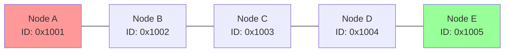

**Routing Table at Node A:**
| Destination | Next Hop | Hops | Link Quality |
|-------------|----------|------|--------------|
| 0x1002      | 0x1002   | 1    | 220          |
| 0x1003      | 0x1002   | 2    | 180          |
| 0x1004      | 0x1002   | 3    | 150          |
| 0x1005      | 0x1002   | 4    | 120          |

**Data Flow A → E:** A → B → C → D → E (4 hops)

#### 4.4.2 Mesh Network Topology

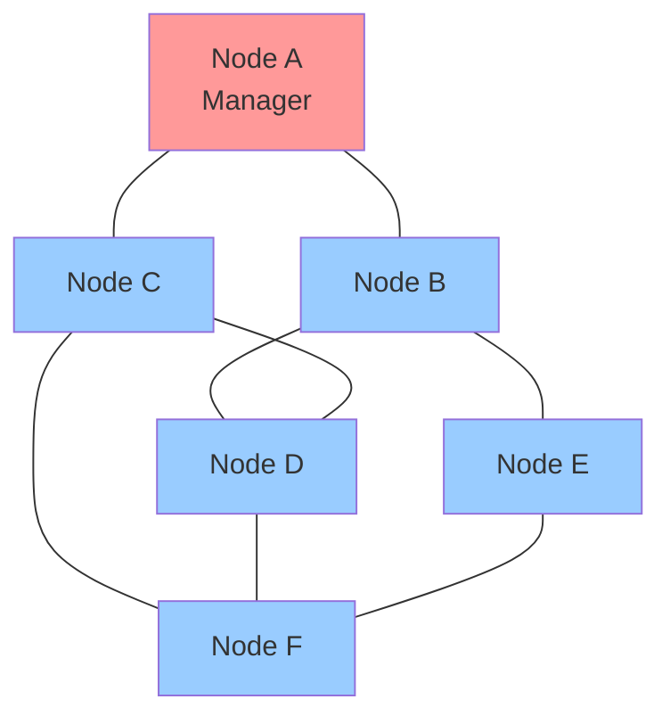

**Routing Table at Node A (Multiple Path Options):**
| Destination | Primary Route | Backup Route | Hops | Quality |
|-------------|---------------|--------------|------|---------|
| 0x1002      | Direct        | via C        | 1    | 240     |
| 0x1003      | Direct        | via B        | 1    | 230     |
| 0x1004      | via B         | via C        | 2    | 200     |
| 0x1005      | via B         | via C→D      | 2    | 190     |
| 0x1006      | via C         | via B→D      | 2    | 200     |

**Optimal Data Paths from A:**
- A → D: A → B → D (2 hops) or A → C → D (2 hops)
- A → E: A → B → E (2 hops, preferred due to higher link quality)
- A → F: A → C → F (2 hops, preferred due to higher link quality)

#### 4.4.3 Star Network Topology

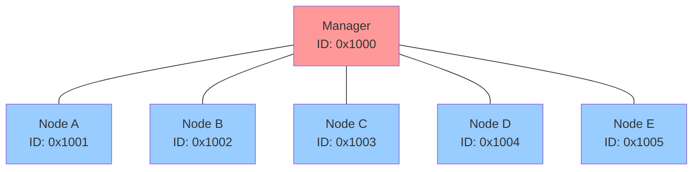

**Routing Table at Node A:**
| Destination | Next Hop | Hops | Link Quality |
|-------------|----------|------|--------------|
| 0x1000      | 0x1000   | 1    | 250          |
| 0x1002      | 0x1000   | 2    | 200          |
| 0x1003      | 0x1000   | 2    | 195          |
| 0x1004      | 0x1000   | 2    | 205          |
| 0x1005      | 0x1000   | 2    | 190          |

**Characteristics:**
- Single point of failure (Manager)
- All inter-node communication requires 2 hops
- Optimal for centralized control scenarios
- Manager handles all routing decisions

#### 4.4.4 Partitioned Network Recovery

This example shows how the network handles and recovers from partitions:

**Before Partition:**
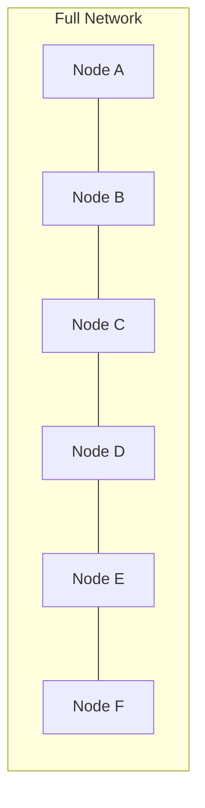

**During Partition (Link C-D Failed):**
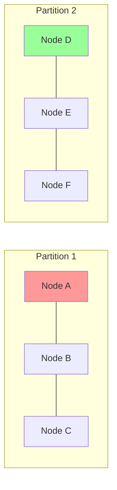

**After Healing (Alternative Path A-G-F Discovered):**
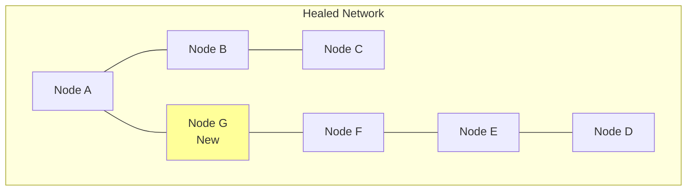

**Route Changes During Healing:**
| Phase | A→D Route | Hops | Status |
|-------|-----------|------|--------|
| Normal | A→B→C→D | 3 | Active |
| Partition | No route | ∞ | Failed |
| Healing | A→G→F→E→D | 4 | Restored |

#### 4.4.5 Load Balancing Example

In networks with multiple equal-cost paths, the protocol can distribute traffic:

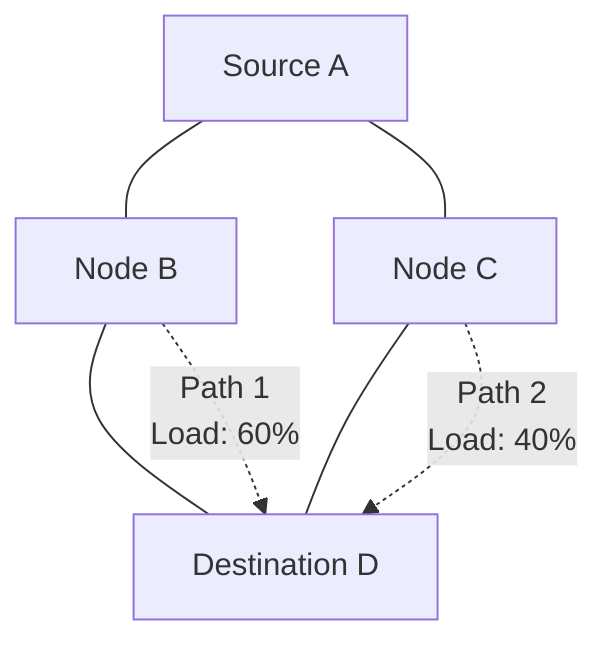

**Load Distribution Logic:**
```cpp
struct LoadBalancing {
    struct PathMetrics {
        uint8_t hops;
        uint8_t linkQuality;
        uint8_t currentLoad;    // 0-100%
        uint32_t lastUsed;
    };
    
    uint16_t selectNextHop(uint16_t destination) {
        auto equalCostPaths = findEqualCostPaths(destination);
        
        // Weighted selection based on current load
        uint16_t selectedPath = 0;
        uint8_t minLoad = 255;
        
        for (auto& path : equalCostPaths) {
            if (path.currentLoad < minLoad) {
                minLoad = path.currentLoad;
                selectedPath = path.nextHop;
            }
        }
        
        return selectedPath;
    }
};
```

### 4.5 Routing Table Architecture

**Overview**: LoRaMesher v1.2 introduces a modular routing table architecture that separates routing logic from network services and provides infrastructure for advanced routing algorithms.

#### 4.5.1 Routing Table Abstraction

**IRoutingTable Interface**:
The new architecture introduces a clean abstraction layer enabling multiple routing algorithm implementations:

```cpp
class IRoutingTable {
public:
    // Core routing operations
    virtual AddressType FindNextHop(AddressType destination) const = 0;
    virtual bool UpdateRoute(AddressType source, AddressType destination,
                           uint8_t hop_count, uint8_t link_quality,
                           uint8_t allocated_data_slots, uint32_t current_time) = 0;

    // Network node management
    virtual bool AddNode(const NetworkNodeRoute& node) = 0;
    virtual bool UpdateNode(AddressType node_address, uint8_t battery_level,
                          bool is_network_manager, uint8_t allocated_data_slots,
                          uint8_t capabilities, uint32_t current_time) = 0;

    // Route table exchange
    virtual std::vector<RoutingTableEntry> GetRoutingEntries(AddressType exclude_address) const = 0;
    virtual bool ProcessRoutingTableMessage(AddressType source_address,
                                          const std::vector<RoutingTableEntry>& entries,
                                          uint32_t reception_timestamp,
                                          uint8_t local_link_quality,
                                          uint8_t max_hops) = 0;
};
```

#### 4.5.2 Current Implementation: Distance-Vector Routing Table

**Features**:
- **Thread-safe operations**: Mutex protection for concurrent access
- **Route aging and cleanup**: Configurable timeout mechanisms
- **Link quality tracking**: Infrastructure for advanced routing metrics
- **Statistics collection**: Performance monitoring and debugging support
- **Versioned table updates**: Efficient change detection and propagation

**Route Selection Logic**:

The routing table selects the active route with the lowest ETX-inspired cost (`hop_count × 65536 / link_quality`), with hop count as tie-breaker. The network service layer then validates the result:

1. **TDMA check** (`IsTDMANeighbor`): the next_hop must have an allocated RX slot in the local TDMA schedule. Nodes overheard from outside the network (no slot allocated) are skipped.
2. **Bidirectional check** (`HasUnidirectionalRisk`): the next_hop must not be a confirmed-unidirectional neighbor (received ≥2 routing messages from them, but their routing table never lists us — `remote_link_quality == 0`).
3. **Fallback**: if the best route fails validation, scan all routes for the destination and select the best TDMA-valid bidirectional alternative. If none exists, use the original route as last resort (natural quality convergence via unidirectional detection will eventually correct the routing table).

#### 4.5.3 Future Advanced Routing Algorithm (Planned)

**Enhanced Metrics Framework**:
The current implementation prepares infrastructure for sophisticated routing algorithms:

```cpp
struct AdvancedRoutingMetrics {
    uint8_t hop_count;              // Current: hop count (implemented)
    uint8_t link_quality;           // Current: signal quality (implemented)
    uint8_t delivery_success_rate;  // Future: message delivery statistics
    uint16_t latency_ms;            // Future: round-trip time measurements
    uint8_t load_factor;            // Future: route congestion metrics
    uint32_t last_success_time;     // Future: route freshness tracking
};
```

**Planned Advanced Features**:
1. **Delivery Success Tracking**: Monitor successful message delivery per route
2. **Latency-Aware Routing**: Factor in round-trip times for route selection
3. **Load Balancing**: Distribute traffic across equal-cost paths
4. **Adaptive Route Selection**: Dynamic routing based on network conditions
5. **Congestion Detection**: Identify and avoid overloaded routes

**Route Selection Algorithm (Future)**:
```cpp
AddressType FindNextHop(AddressType destination) const {
    // Multi-metric route evaluation
    float best_score = 0;
    AddressType best_next_hop = 0;

    for (const auto& route : available_routes) {
        float score = CalculateRouteScore(route);
        if (score > best_score) {
            best_score = score;
            best_next_hop = route.next_hop;
        }
    }

    return best_next_hop;
}

float CalculateRouteScore(const Route& route) {
    // Weighted multi-metric scoring
    float hop_score = (256.0 - route.hop_count) / 256.0;
    float quality_score = route.link_quality / 255.0;
    float delivery_score = route.delivery_success_rate / 100.0;
    float latency_score = 1.0 / (1.0 + route.latency_ms / 1000.0);

    return (hop_score * 0.2) + (quality_score * 0.3) +
           (delivery_score * 0.4) + (latency_score * 0.1);
}
```

#### 4.5.4 Architecture Benefits

**Modularity**: Clean separation allows easy algorithm replacement
**Extensibility**: Framework ready for advanced routing metrics
**Performance**: Optimized data structures and thread-safe operations
**Testability**: Interface abstraction enables comprehensive unit testing
**Future-Proofing**: Infrastructure prepared for sophisticated routing enhancements

---

## 5. Network Synchronization (TDMA)

### 5.1 Superframe Structure

The TDMA system organizes time into power-optimized superframes with multi-hop synchronization support:

```
┌─────────────────────────────────────────────────────────────────────────────┐
│                    POWER-OPTIMIZED SUPERFRAME STRUCTURE (Updated v1.5)       │
│                              (Example: 20 slots)                           │
├─────────────────────────────────────────────────────────────────────────────┤
│                                                                             │
│ Slot │ Type           │ Purpose              │ Power State                   │
│ ──────────────────────────────────────────────────────────────────────────  │
│  0   │ SYNC_BEACON_TX │ NM original beacon   │ TX (Network Manager only)     │
│  1   │ SYNC_BEACON_TX │ 1-hop forwarding     │ TX (1-hop nodes only)         │
│  2   │ SYNC_BEACON_TX │ 2-hop forwarding     │ TX (2-hop nodes only)         │
│  3   │ CONTROL_TX     │ NM routing table     │ TX (Network Manager)          │
│  4   │ CONTROL_TX     │ Node A routing       │ TX (Node A), RX (others)      │
│  5   │ CONTROL_TX     │ Node B routing       │ TX (Node B), RX (others)      │
│  6   │ DATA_TX        │ Node A data          │ TX (Node A), RX (neighbors)   │
│  7   │ DATA_TX        │ Node B data          │ TX (Node B), RX (neighbors)   │
│  8-15│ SLEEP          │ Power conservation   │ SLEEP (reduced for optimization) │
│ 16   │ DISCOVERY_RX   │ New node detection   │ RX (all nodes)                │
│ 17   │ DISCOVERY_RX   │ Network monitoring   │ RX (all nodes)                │
│ 18-19│ SLEEP          │ Final power saving   │ SLEEP (end of superframe)     │
│                                                                             │
├─────────────────────────────────────────────────────────────────────────────┤
│ POWER CHARACTERISTICS:                                                      │
│ • Active Slots: 10 (50% - sync: 3, control: 3, data: 2, discovery: 2)     │
│ • Sleep Slots: N (configurable TX duty cycle ≥1% and/or sleep fraction ≥30%)│
│ • Actual Duty Cycle: 50% (configurable based on network size)              │
│ • Power Savings: 50% sleep time, adaptive based on traffic                 │
└─────────────────────────────────────────────────────────────────────────────┘
```

### 5.2 Timing Parameters

The TDMA timing is configured through two separate structures:

**Superframe Structure** (`types/protocols/lora_mesh/superframe.hpp`):
```cpp
struct Superframe {
    uint16_t total_slots = 0;           // Total number of slots in the superframe
    uint16_t data_slots = 0;            // Number of data transmission/reception slots
    uint16_t discovery_slots = 0;       // Number of discovery slots for network joining
    uint16_t control_slots = 0;         // Number of control slots for management
    uint32_t slot_duration_ms = 0;      // Duration of each slot in milliseconds
    uint32_t superframe_start_time = 0; // Start time of current superframe cycle
};

// Default configuration (discovery phase only; see auto-calculation below)
Superframe defaultSuperframe = {
    .total_slots = 100,
    .data_slots = 60,
    .discovery_slots = 20,
    .control_slots = 20,
    .slot_duration_ms = 1000,      // Fallback for discovery phase
    .superframe_start_time = 0
};
```

**Protocol Configuration** (`types/configurations/protocol_configuration.hpp`):
```cpp
// Relevant timing parameters from LoRaMeshProtocolConfig
uint8_t max_hops_ = 10;           // Maximum number of hops for routing (1-16)
uint32_t guard_time_ms_ = 50;     // TX guard time for RX readiness (10-500ms)
float target_duty_cycle_ = 0.01f;  // Target TX duty cycle (0.001–1.0, default 1%)
```

**Automatic Slot Duration Calculation:**

When the Network Manager creates a network (`CreateNetwork()`), the slot duration is auto-calculated from the radio's time-on-air parameters:

```
slot_duration_ms = ceil_50(ToA(max_packet_size) + guard_time_ms + 50ms)
```

Where `ceil_50` rounds up to the nearest 50 ms and the 50 ms margin covers superframe detection latency and task scheduling. The 1000 ms default is only used during the discovery phase before the radio configuration is available. The NM broadcasts the computed slot duration to all nodes via the sync beacon.

*Note: `sync_tolerance_ms` is a planned feature (see Section 10 Future Work).*

### 5.3 Synchronization Protocol

#### 5.3.1 Network Manager Synchronization

The network manager broadcasts optimized synchronization information in slot 0:

```cpp
struct SyncBeaconHeader {
    // Standard message header (6 bytes)
    AddressType destination = 0xFFFF;    // Broadcast to all nodes (2 bytes)
    AddressType source;                  // Current transmitter address (2 bytes)
    MessageType type = SYNC_BEACON;      // Message type 0x46 (1 byte)
    uint8_t payload_size = 0;            // No payload data (1 byte)

    // Core synchronization fields (7 bytes)
    uint16_t network_id;                 // Network identifier (2 bytes)
    uint8_t total_slots;                 // Slots in complete superframe (1 byte)
    uint16_t slot_duration_ms;           // Individual slot duration (2 bytes)
    AddressType network_manager;         // Network Manager address (2 bytes)

    // Multi-hop forwarding fields (6 bytes)
    uint8_t hop_count;                   // Hops from Network Manager (1 byte)
    uint32_t propagation_delay_ms;       // Accumulated forwarding delay (4 bytes)
    uint8_t max_hops;                    // Network diameter limit (1 byte)

    // Network topology field (1 byte) [v1.4]
    uint8_t node_count;                  // Active nodes in network (1 byte)
};
// Total: 20 bytes (6 base + 14 sync fields)
```

#### 5.3.1.1 Slot Allocation Updates via Sync Beacon

The sync beacon serves dual purposes: network synchronization and slot allocation coordination. When a new node joins the network, the `total_slots` and `node_count` fields communicate the updated superframe structure to all nodes.

**Slot Allocation Update Process**:

1. **Join Request Buffering**: Network Manager buffers up to 3 join requests until superframe boundary; additional requests receive `RETRY_LATER`
2. **Superframe Boundary**: At sync beacon transmission, apply all pending joins atomically
3. **Updated Sync Beacon**: `total_slots` field reflects new superframe size, `node_count` field reflects authoritative control slot count
4. **Network-Wide Update**: All nodes recalculate slot allocations based on new `total_slots` and `node_count`

```cpp
void ProcessSyncBeaconForSlotUpdates(const SyncBeaconHeader& beacon) {
    // Check if slot allocation has changed
    if (beacon.total_slots_ != current_total_slots_ ||
        beacon.node_count_ != current_node_count_) {

        // Use NM's authoritative node_count for control slot allocation
        allocated_control_slots_ = beacon.node_count_;

        RecalculateSlotAllocation(beacon.total_slots_);
        current_total_slots_ = beacon.total_slots_;
        current_node_count_ = beacon.node_count_;
    }
    ProcessTimeSynchronization(beacon);
}
```

**Benefits of Sync Beacon Slot Updates**:
- **No Additional Messages**: Leverages existing sync beacon infrastructure
- **Network-Wide Coordination**: All nodes receive updates simultaneously
- **Deterministic Timing**: Updates occur at predictable superframe boundaries
- **Minimal Overhead**: Single byte (`total_slots`) communicates changes

#### 5.3.2 Time Synchronization Algorithm

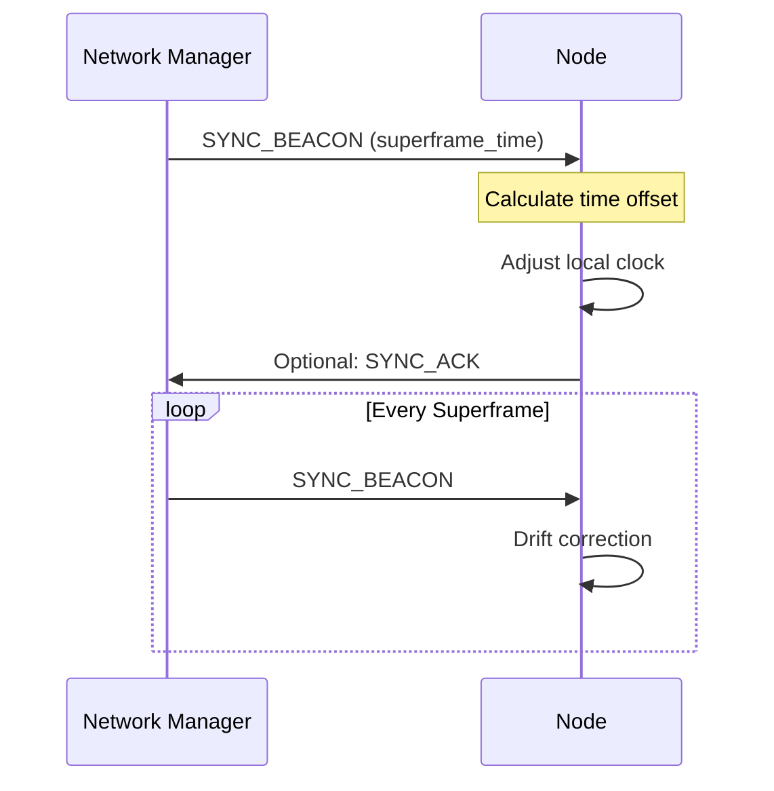

**Clock Adjustment Logic**:
```cpp
void ProcessSyncBeacon(const SyncMessage& sync) {
    uint32_t receivedTime = getCurrentLocalTime();
    uint32_t expectedTime = sync.superframeTime;
    int32_t drift = receivedTime - expectedTime;
    
    if (abs(drift) > syncTolerance) {
        // Large drift - hard sync
        setLocalTime(expectedTime);
        logEvent("Hard sync: drift = " + std::to_string(drift));
    } else if (abs(drift) > syncTolerance / 2) {
        // Small drift - gradual adjustment
        adjustClockRate(drift);
        logEvent("Soft sync: drift = " + std::to_string(drift));
    }
    
    lastSyncTime = receivedTime;
}
```

> **Note**: Only one sync beacon is processed per superframe. If a sync beacon is received within half the superframe duration of the previously processed one, it is silently ignored. This prevents redundant timing adjustments when a node receives multiple forwarded copies of the same beacon from different hops.

### 5.4 Slot Allocation

#### 5.4.1 Initial Allocation

New nodes request slots during the join process:

1. **Slot Request**: Include desired number of slots in JOIN_REQUEST
2. **Slot Assignment**: Network manager assigns available slots
3. **Slot Confirmation**: Node confirms slot usage in first transmission

#### 5.4.2 Dynamic Reallocation

```cpp
struct SlotRequest {
    uint8_t messageType;     // SLOT_REQUEST (0x23)
    uint16_t nodeId;         // Requesting node
    uint8_t requestedSlots;  // Number of slots needed
    uint8_t priority;        // Request priority (0-255)
    uint8_t reason;          // Reason for request
    uint8_t checksum;        // Message integrity
};
```

### 5.5 Multi-Hop Synchronization Strategy

#### 5.5.1 The Multi-Hop Synchronization Challenge

In mesh networks, nodes beyond 1-hop distance from the Network Manager cannot directly receive synchronization beacons. A robust multi-hop forwarding strategy is essential for network-wide time synchronization while avoiding message collisions.

**Problem Statement:**
- **Direct Sync Limitation**: Network Manager broadcasts sync beacon (reaches 1-hop neighbors only)
- **Collision Challenge**: Naive forwarding causes massive collisions when all 1-hop neighbors rebroadcast simultaneously
- **LoRa Collision Risk**: Multiple simultaneous transmitters result in 80-90% collision probability

#### 5.5.2 Hop-Layered Collision-Free Forwarding Solution

**Core Innovation: Sequential Hop Transmission**

The protocol uses hop-layered slot allocation where different hop distances transmit in different time slots:

```
┌─────────────────────────────────────────────────────────────────────────────┐
│                   SYNC BEACON SLOT ALLOCATION BY HOP COUNT                  │
├─────────────────────────────────────────────────────────────────────────────┤
│                                                                             │
│  Slot    Purpose              NM (hop=0)  Node A (hop=1)  Node B (hop=2)   │
│  ────────────────────────────────────────────────────────────────────────   │
│   0   │ Original transmission    TX          RX            RX              │
│   1   │ 1-hop forwarding        SLEEP        TX            RX              │  
│   2   │ 2-hop forwarding        SLEEP       SLEEP          TX              │
│   3   │ 3-hop forwarding        SLEEP       SLEEP         SLEEP            │
│  ...  │ Additional hops          ...         ...           ...             │
│   N   │ Control/Data slots      CTRL         CTRL          CTRL            │
└─────────────────────────────────────────────────────────────────────────────┘
```

**Slot Assignment Algorithm:**
```cpp
// For each sync beacon slot (0 to max_hops-1)
for (hop_layer = 0; hop_layer < max_hops; hop_layer++) {
    if (hop_layer == 0) {
        // Slot 0: Network Manager original transmission  
        if (is_network_manager) {
            slot[0] = SYNC_BEACON_TX;  // NM sends original
        } else {
            slot[0] = SYNC_BEACON_RX;  // Others receive
        }
    } else {
        // Slots 1+: Hop-layered forwarding
        if (my_hop_distance == hop_layer) {
            slot[hop_layer] = SYNC_BEACON_TX;  // Forward from previous hop
        } else if (my_hop_distance == hop_layer + 1) {
            slot[hop_layer] = SYNC_BEACON_RX;  // Receive for next hop
        } else {
            slot[hop_layer] = SLEEP;  // Sleep if not relevant
        }
    }
}
```

**Benefits:**
- **Zero inter-hop collisions**: Different hops transmit in different slots
- **Controlled same-hop collisions**: LoRa's capture effect handles simultaneous same-hop forwards
- **Predictable timing**: Each hop knows when to forward based on distance from Network Manager

> **Forwarding eligibility**: While slot assignment uses strict hop-layer matching (TX only in `my_hop_distance` slot), forwarding eligibility is broader: a node forwards any received sync beacon where `beacon_hop_count < max_hops`. The rate limiter (one beacon per superframe/2) ensures only the first-heard beacon is processed, making hop-layer filtering unnecessary and supporting mobile nodes whose routing-table distance may be stale. The forwarded beacon's hop count is set to `beacon_hop_count + 1`, reflecting the actual number of hops traveled.

#### 5.5.3 Intra-Slot Collision Mitigation (Subslot Scheduling)

While Section 5.5.2 eliminates inter-hop collisions by assigning different hops to different slots, nodes at the **same hop distance** still transmit in the same slot. This section describes the deterministic subslot division mechanism that mitigates collisions among same-hop forwarders and among discovering nodes.

**Affected Slot Types:**
- `SYNC_BEACON_TX` — Multiple same-hop nodes forwarding sync beacons
- `DISCOVERY_TX` — Multiple discovering nodes transmitting discovery messages
- `DISCOVERY_RX` — Also transmits queued discovery messages as fallback; this is the primary delivery mechanism for sponsor-forwarded join requests and responses

**Subslot Division Model:**

Each slot is divided into `N` subslots. Each node is deterministically assigned to one subslot based on a node-specific identifier.

```
|--- Slot Duration (e.g., 1000ms) ----------------------------------------|
|Guard|Subslot0_TX|Guard|Subslot1_TX|...|Guard|SubslotN-1_TX|  RX_Tail    |
```

**Configuration Parameters** (`SubslotConfig`):

| Parameter | Default | Description |
|-----------|---------|-------------|
| `num_subslots` | 5 | Number of subslots per slot |
| `guard_time_ms` | 50 ms | Guard time before each subslot TX window (configurable) |
| `strategy` | Slot-dependent | `HOP_BASED`, `ADDRESS_MODULO`, or `RANDOM` |

**Timing Formulas:**
```
total_guard     = num_subslots × guard_time_ms
available_tx    = slot_duration - total_guard
tx_window       = available_tx / num_subslots
subslot_duration = guard_time_ms + tx_window
tx_start_offset(i) = i × subslot_duration + guard_time_ms
```

**Example** (slot_duration=1000ms, num_subslots=5, guard=10ms):
```
total_guard     = 50 ms
available_tx    = 950 ms
tx_window       = 190 ms
subslot_duration = 200 ms

Subslot 0: TX at [10, 200) ms
Subslot 1: TX at [210, 400) ms
Subslot 2: TX at [410, 600) ms
Subslot 3: TX at [610, 800) ms
Subslot 4: TX at [810, 1000) ms
```

**Assignment Strategies:**

| Strategy | Formula | When Used |
|----------|---------|-----------|
| `ADDRESS_MODULO` | `subslot = node_address % N` | Sync beacon, control, and data slots — deterministic and consistent across the network |
| `RANDOM` | `subslot = random() % N` | Discovery TX (default) — Slotted ALOHA approach; caller provides a hardware-generated random value via `RTOS::GetRandom()`, so each attempt picks a different subslot, resolving collisions probabilistically |

**Radio State Behavior During Subslotted Slots:**

1. At slot start: radio is set to `kReceive` immediately (catch transmissions from earlier subslots)
2. At `tx_start_offset`: node transmits its message
3. After TX completes: radio returns to `kReceive` (not `kSleep`)
4. After any RX event: radio stays in `kReceive` (not `kSleep`)
5. At slot transition: `in_subslotted_slot` flag resets, normal sleep behavior resumes

**Sequence for SYNC_BEACON_TX Slot (3-hop network):**
```
Time    NM (hop=0, subslot=0)    NodeA (hop=1, subslot=1)    NodeB (hop=2, subslot=2)
─────   ────────────────────     ───────────────────────     ───────────────────────
0ms     RX (guard)               RX (guard)                  RX (guard)
10ms    TX sync beacon           RX (listen)                 RX (listen)
200ms   RX (done TX)             RX (guard for subslot 1)    RX (listen)
210ms   RX (listen)              TX sync beacon              RX (listen)
400ms   RX (listen)              RX (done TX)                RX (guard for subslot 2)
410ms   RX (listen)              RX (listen)                 TX sync beacon
600ms   RX (listen)              RX (listen)                 RX (done TX)
1000ms  Slot transition          Slot transition             Slot transition
```

**Same-Hop Collision Handling:**

Nodes at the same hop distance map to the same subslot. This is an accepted design trade-off:
- LoRa's **capture effect** means the stronger signal is received successfully (3-6 dB advantage typical)
- For denser networks, a secondary address-based subdivision can be added within each hop-based subslot as a future enhancement

**Subslot Fallback:**

Before transmitting, the protocol checks whether the message's ToA fits within the assigned subslot window using `CanFitInSlot(message_size, subslot_delay)`. If the subslot offset pushes the transmission past the slot boundary, the node falls back to immediate (non-subslotted) TX. If the message still does not fit in the remaining slot time, the TX is skipped entirely.

**Validation:**

The `SubslotScheduler::ValidateConfig()` method checks feasibility:
1. Guard times must not exceed total slot duration
2. Each subslot TX window must accommodate the estimated time-on-air (ToA)
3. At higher spreading factors (SF12), packets may exceed subslot windows — the NM auto-calculates `slot_duration_ms` accordingly

### 5.6 Control Slot Allocation Strategy

Control slots are allocated using NM-assigned indices tracked in the routing table. The NM is the single authority for slot assignments:

1. **NM assigns `control_slot_index`** to each node at join time (in JOIN_RESPONSE)
2. NM tracks assignments in its routing table (`NetworkNodeRoute.control_slot_index`)
3. Re-joining nodes reuse their existing index; new nodes get the lowest available
4. NM broadcasts `node_count` in SYNC_BEACON = max assigned index + 1
5. All nodes use `node_count` as `allocated_control_slots_`
6. Each node's CONTROL_TX slot = `sync_beacon_slots + my_control_slot_index_`
7. All other control slots are CONTROL_RX

**Key Benefits:**
- **Authoritative**: NM is the single source of truth for slot assignments
- **Conflict-Free**: Each node gets exactly one CONTROL_TX slot per superframe
- **Re-join Safe**: Re-joining nodes reuse their previous slot, preventing index inflation
- **Gap Recycling**: Departed nodes' indices are recycled for future joiners
- **Consistent**: All nodes agree on `allocated_control_slots_` via `node_count` in sync beacon

### 5.7 TX Guard Time Mechanism

#### 5.7.1 Purpose and Motivation

The TX guard time mechanism addresses the fundamental challenge of RX readiness in TDMA-based mesh networks. When a node begins transmitting at the precise start of its allocated slot, other nodes may not have sufficient time to transition from sleep/idle state to active reception, resulting in lost synchronization and data packets.

**Problem Statement:**
- **RX Setup Time**: Nodes require finite time to transition from sleep to active reception
- **Clock Drift**: Small timing differences between nodes can cause missed receptions
- **Synchronization Preservation**: Lost sync beacons can cause network fragmentation
- **LoRa Radio Constraints**: SX126x/SX127x radios need setup time for frequency, spreading factor, and RX configuration

#### 5.7.2 Guard Time Implementation

**Core Concept**: TX nodes delay their transmission by a configurable guard time to ensure RX nodes are ready to receive.

```cpp
// Guard time configuration
struct GuardTimeConfig {
    uint32_t guard_time_ms;        // TX delay for RX readiness (default: 50ms)
    uint32_t transmission_delay_ms; // Calculated via get_time_on_air()
    uint32_t sync_compensation_ms;  // Timing compensation for sync beacons
};

// Implementation in slot processing
void ProcessSlotMessages(uint16_t current_slot, SlotAllocation::SlotType slot_type) {
    switch (slot_type) {
        case SlotAllocation::SlotType::SYNC_BEACON_TX:
        case SlotAllocation::SlotType::CONTROL_TX:
        case SlotAllocation::SlotType::DATA_TX:
            // Apply guard time delay before transmission
            uint32_t guard_delay = config_.guard_time_ms;
            
            // Sleep for guard time to allow RX nodes to prepare
            GetRTOS().DelayTask(guard_delay);
            
            // Proceed with transmission
            TransmitSlotMessage(current_slot, slot_type);
            break;
            
        case SlotAllocation::SlotType::SYNC_BEACON_RX:
        case SlotAllocation::SlotType::CONTROL_RX:
        case SlotAllocation::SlotType::DATA_RX:
            // RX nodes start listening immediately (no guard time)
            ReceiveSlotMessage(current_slot, slot_type);
            break;
    }
}
```

#### 5.7.3 Timing Compensation for Synchronization

**Challenge**: Guard time delays can cause timing drift in sync beacon reception, leading to network desynchronization.

**Solution**: Compensate for guard time and transmission delays when processing sync beacons.

```cpp
void ProcessSyncBeacon(const SyncBeaconHeader& sync_beacon) {
    // Calculate total delay introduced by guard time mechanism
    uint32_t guard_delay = config_.guard_time_ms;
    uint32_t transmission_delay = GetTimeOnAir(sync_beacon);
    uint32_t total_delay = guard_delay + transmission_delay;
    
    // Apply compensation to superframe synchronization
    superframe_service_->SynchronizeWith(total_delay, current_slot);
    
    // Update propagation delay for multi-hop forwarding
    if (sync_beacon.hop_count > 0) {
        uint32_t updated_delay = sync_beacon.propagation_delay_ms + total_delay;
        ForwardSyncBeacon(sync_beacon, updated_delay);
    }
}
```

#### 5.7.4 Multi-Hop Synchronization with Guard Time

**Forward Sync Beacon with Accumulated Timing**:
```cpp
void ForwardSyncBeacon(const SyncBeaconHeader& received_beacon, uint32_t slot_type) {
    // Create forwarded beacon with updated timing
    SyncBeaconHeader forward_beacon = received_beacon;
    forward_beacon.source = node_address_;
    forward_beacon.hop_count = received_beacon.hop_count + 1;
    
    // Accumulate guard time and transmission delays
    uint32_t guard_delay = config_.guard_time_ms;
    uint32_t transmission_delay = GetTimeOnAir(forward_beacon);
    forward_beacon.propagation_delay_ms = 
        received_beacon.propagation_delay_ms + guard_delay + transmission_delay;
    
    // Apply guard time before forwarding
    GetRTOS().DelayTask(guard_delay);
    
    // Forward with accumulated timing compensation
    TransmitMessage(forward_beacon);
}
```

#### 5.7.5 Configuration Guidelines

**Guard Time Selection**:
- **Minimum**: 20ms (basic radio setup time)
- **Recommended**: 50ms (reliable for most network conditions)
- **Maximum**: 100ms (high-latency environments)

**Considerations**:
- **Network Size**: Larger networks may need longer guard times
- **Clock Accuracy**: Poor clock accuracy requires longer guard times
- **Power Constraints**: Longer guard times reduce effective slot utilization
- **Latency Requirements**: Applications requiring low latency should minimize guard time

#### 5.7.6 Benefits and Trade-offs

**Benefits**:
- **Improved Synchronization**: Higher sync beacon reception success rate
- **Reduced Packet Loss**: Better RX readiness reduces data loss
- **Network Stability**: More reliable TDMA coordination
- **Adaptive Timing**: Compensates for hardware and clock variations

**Trade-offs**:
- **Reduced Slot Utilization**: Guard time reduces effective transmission time
- **Increased Latency**: Additional delay in slot processing
- **Power Consumption**: Longer active periods during guard time
- **Complexity**: Additional timing calculations and compensation logic

#### 5.7.7 Per-Message Time-on-Air Check

Before every transmission, the protocol verifies that the specific message's time-on-air fits within the remaining slot time using `CanFitInSlot()`:

```
fits = (time_in_slot + pre_tx_delay + ToA(message_size) + kRxProcessingMarginMs) <= slot_duration
```

Where:
- `time_in_slot`: current elapsed time within the slot (real-time)
- `pre_tx_delay`: pending delay before TX (guard time for non-subslotted, subslot offset for subslotted)
- `ToA(message_size)`: hardware-computed time-on-air for the actual message
- `kRxProcessingMarginMs` (20 ms): margin for the receiver to finish processing before the slot ends

**Non-subslotted TX** (CONTROL_TX, TX, SYNC_BEACON_TX for NM): the guard time is passed as `pre_tx_delay`. If the check fails, the message is not transmitted.

**Subslotted TX** (DISCOVERY_TX, SYNC_BEACON_TX for non-NM): if the check fails with the subslot offset, the node retries with `pre_tx_delay = 0` (immediate TX, bypassing the subslot). If it still does not fit, the message is re-queued for the next slot attempt.

### 5.8 Power-Aware Slot Allocation

#### 5.8.1 Slot Types and Power States

| Slot Type | Purpose | Power State |
|-----------|---------|-------------|
| TX | Transmit data/control messages | Active (High Power) |
| RX | Receive data/control messages | Active (Medium Power) |
| SYNC_BEACON_TX | Transmit beacon synchronization | Active (High Power) |
| SYNC_BEACON_RX | Receive beacon synchronization | Active (Medium Power) |
| CONTROL_TX | Transmit network management | Active (High Power) |
| CONTROL_RX | Receive network management | Active (Medium Power) |
| DISCOVERY_TX | Transmit discovery messages (subslotted) | Active (High Power) |
| DISCOVERY_RX | Listen for discovery; fallback TX if queued | Active (Medium Power) |
| SLEEP | Radio power down | Sleep (Minimal Power) |

#### 5.8.2 Power-Optimized Slot Allocation Formula

For N-node network (1 manager + N-1 regular nodes):

```
Required Active Slots:
- Beacon Slots = max_hops (hop-layered forwarding)
- Control Slots = N (1 TX manager + N-1 RX nodes)
- Data Slots = N × data_slots_per_node
- Discovery Slots = min(5, max(2, ceil(N/3)))
- Total Active = Beacon + Control + Data + Discovery

Power-Optimized Superframe (TX-time-based, configurable):
- Target TX Duty Cycle   = configurable (default 1%, range 0.1%–100%)
- Min Sleep Fraction     = configurable (default 30%, range 0%–90%)
- NM TX Time = ToA(sync_beacon) + ToA(routing_table) + nm_data_slots × ToA(max_packet)
- Minimum Total Slots (TX)    = ceil(NM_TX_time_ms / (slot_duration_ms × target_duty_cycle))
- Minimum Total Slots (Sleep) = ceil(total_active_slots / (1 − min_sleep_fraction))
- Superframe Size = max(Minimum Total Slots (TX), kMinSlots,
                        Minimum Total Slots (Sleep))
- SLEEP Slots = Superframe Size − Total Active
- Actual TX Duty Cycle = NM_TX_time_ms / (Superframe Size × slot_duration_ms)
```

The TX-only metric ensures slot count scales with *transmit* time rather than total active slots,
giving a physically meaningful duty cycle independent of how many nodes are listening. The
`min_sleep_fraction` parameter guarantees a minimum sleep budget even in large dense networks
where the TX-based formula alone might produce zero sleep slots. Example:

```cpp
LoRaMeshProtocolConfig config;
config.setTargetDutyCycle(0.01f);   // 1% TX duty cycle (default)
// Valid range: 0.001f (0.1%) to 1.0f (100%)
config.setMinSleepFraction(0.30f);  // ≥30% of superframe as sleep (default)
// Valid range: 0.0f (no minimum) to 0.9f (90% sleep)
```

#### 5.8.3 Application Power Management Callbacks

The protocol provides callback hooks allowing applications to implement device-specific power management during SLEEP slots. This enables optimal power consumption without adding hardware dependencies to the core library.

##### Power State Transitions

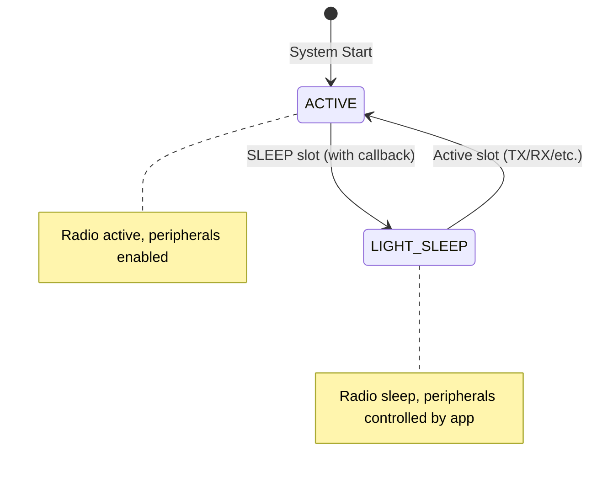

##### Callback Invocation Points

| Transition | Callback | When Invoked |
|------------|----------|--------------|
| Active → Sleep | `PrepareSleepCallback` | Beginning of SLEEP slot |
| Sleep → Active | `WakeUpCallback` | Beginning of any active slot |

##### PrepareSleepCallback

Invoked before the device enters a SLEEP slot. Receives a `SleepContext` with:
- `requested_state`: The target power state (LIGHT_SLEEP)
- `sleep_duration_ms`: Time until next slot (slot duration)
- `current_slot`: Current slot number in superframe
- `has_pending_messages`: Whether TX queue has messages

Returns a `SleepResult`:
- `allow_sleep`: If false, radio sleeps but device state remains ACTIVE
- `max_sleep_duration_ms`: Maximum allowed sleep (reserved for future use)

##### WakeUpCallback

Invoked when transitioning from a SLEEP slot to any active slot (TX, RX, CONTROL_*, SYNC_*, DISCOVERY_*). Receives the previous power state to allow appropriate restoration.

##### Usage Example

```cpp
auto mesher = LoraMesher::Builder()
    .withLoRaMeshProtocol()
    .withPrepareSleepCallback([](const power::SleepContext& ctx) {
        // Only sleep if duration is worthwhile
        if (ctx.sleep_duration_ms < 50) {
            return power::SleepResult{false};  // Too short, stay active
        }

        // Disable peripherals for power saving
        GPS::disable();
        Sensors::powerDown();

        return power::SleepResult{true};  // Allow sleep
    })
    .withWakeUpCallback([](power::PowerState previous) {
        // Restore peripherals
        GPS::enable();
        Sensors::powerUp();
    })
    .Build();
```

##### Timing Considerations

- Callbacks execute in protocol task context
- Keep callback execution time minimal (< 5ms recommended)
- Long operations may cause slot timing issues
- Sleep veto still allows radio sleep for power saving

### 5.9 Network Manager Election Sequence

Implemented. When a node misses `kExpandListeningThreshold` (2) consecutive sync beacons, all sync beacon SLEEP and TX slots are temporarily converted to SYNC_BEACON_RX. This allows the node to hear beacons from any hop layer, recovering from cases where a hop-distance change left the slot table with wrong RX assignments (e.g., a node heard the NM directly, updated to hop=1, then lost the direct link). Normal slot allocation is restored automatically when the next beacon is received and triggers `UpdateSlotTable()`.

If missed beacons reach `kMaxNoReceivedSyncBeacons` (5) the node enters FAULT_RECOVERY and starts a weighted staggered-backoff timer:

```
election_delay = kElectionListenWindowMs (5 000 ms)           // mandatory anti-flap window
               + role_bonus   (0 for NETWORK_MANAGER role, else kElectionListenWindowMs)
               + addr_bonus   (kElectionListenWindowMs × (addr & 0xFF) / 256)
               + jitter       (0 – kElectionListenWindowMs/2 ms, random)
```

`NODE_ONLY` nodes never enter election (`election_delay = 0` = disabled).

**When the timer expires**:
1. `SetDiscoverySlots()` — switches slot table to DISCOVERY_RX so NM_CLAIM can be sent immediately
2. Queues NM_CLAIM in DISCOVERY_TX; transmitted in the same slot via DISCOVERY_RX fallback
3. Transitions to NM_ELECTION and waits `2 × slot_duration` for counter-claims

**On receiving NM_CLAIM** (in FAULT_RECOVERY or NM_ELECTION):
- If their `election_priority` < ours → surrender: cancel backoff, `StartDiscovery()`
- Otherwise ignore

**Election priority** (lower = wins):
```
NETWORK_MANAGER role: base 0–63   (always beats AUTO)
AUTO role:            base 64–191
NODE_ONLY:            0xFF (never wins)
+ addr_component = (node_address & 0xFF) >> 1  (lower address wins ties)
```

After `2 × slot_duration` with no surrender trigger → `CreateNetwork()` → NETWORK_MANAGER.
Stable `network_id_` (set at `CreateNetwork()`, preserved from received beacons) ensures rejoining nodes recognise the new NM as the same logical network.

**Node role behavior**:
- **Explicit designation**: Configure a node with `NodeRole::NETWORK_MANAGER` to get lowest election priority base (0–63)
- **Implicit designation**: With `NodeRole::AUTO` (default), nodes use election priority base 64–191
- **Join-only nodes**: Configure with `NodeRole::NODE_ONLY` to prevent network creation entirely

### 5.10 Application Data Slot Timing API

#### 5.10.1 Motivation

Application code that calls `Send()` must have its message queued **before** the TX
data slot begins. Since LoRaMesher is TDMA-scheduled, there is a fixed window within
each superframe during which user data can actually be transmitted. Calling `Send()`
too late (during an already-executing TX slot) means the message will wait a full
superframe before it can be sent.

To help applications schedule sends reliably, LoRaMesher provides two query functions.

#### 5.10.2 `GetTimeUntilNextDataSlot(guard_time_ms)`

Returns the number of milliseconds an application should sleep before calling
`Send()`, so that the queued message is guaranteed to be processed in the **next** TX
data slot.

**Semantics:**
- Scans the node's slot table for all slots of type `TX`.
- For each TX slot, computes: `time_until_slot_start - guard_time_ms`.
- If the slot is already past or within `guard_time_ms` (i.e. too close), that slot is
  skipped and the same slot in the **next superframe** is considered instead.
- Returns the minimum non-negative adjusted wait across all TX slots.
- Returns `0` if the node has no TX slots allocated (not yet in `NORMAL_OPERATION`).

**Guard time**: the `guard_time_ms` parameter (default **200 ms**) accounts for:
1. FreeRTOS task wake-up and scheduling latency
2. Application processing time before calling `Send()`
3. Protocol queue pickup and message preparation before radio TX begins

| Situation | `GetTimeUntilNextDataSlot(200)` result |
|---|---|
| Next TX slot in 2000ms | 1800ms |
| Next TX slot in 150ms (< guard) | Skip → next occurrence + superframe |
| Currently in TX slot | time_until=0 ≤ guard → skip to next superframe |
| No TX slots in slot table | 0 |
| Protocol not started | 0 |

**Typical usage:**
```cpp
// Simple: send once per superframe, precisely timed to the next TX slot
while (true) {
    uint32_t wait_ms = mesh.GetTimeUntilNextDataSlot();
    vTaskDelay(pdMS_TO_TICKS(wait_ms));
    mesh.Send(destination, payload);
}
```

#### 5.10.3 `GetDataSlotsPerSuperframe()`

Returns how many TX data slots are allocated to this node per superframe. This allows
applications to know the maximum number of independent messages they can send per
cycle.

**Typical usage (multi-slot):**
```cpp
// Fill every TX slot in each superframe
while (true) {
    uint8_t slots = mesh.GetDataSlotsPerSuperframe();
    for (uint8_t i = 0; i < slots; i++) {
        uint32_t wait_ms = mesh.GetTimeUntilNextDataSlot();
        vTaskDelay(pdMS_TO_TICKS(wait_ms));
        mesh.Send(destination, generate_reading());
    }
}
```

#### 5.10.4 Interaction with the TX Guard Time (Section 5.7)

The **protocol-level** TX guard time (section 5.6) is a separate delay applied
*inside* the TX slot to ensure RX nodes are ready. The **application guard time**
used by `GetTimeUntilNextDataSlot()` is an *additional, earlier* offset applied
*outside* the TX slot to give the application itself time to wake up and queue
the message. Both guard times stack and must together be smaller than one slot
duration.

---

## 6. Network Discovery & Joining

### 6.1 Network Discovery Process

The current implementation uses **sync beacon-based discovery** rather than explicit discovery request/response messages. Nodes discover existing networks by listening for SYNC_BEACON broadcasts.

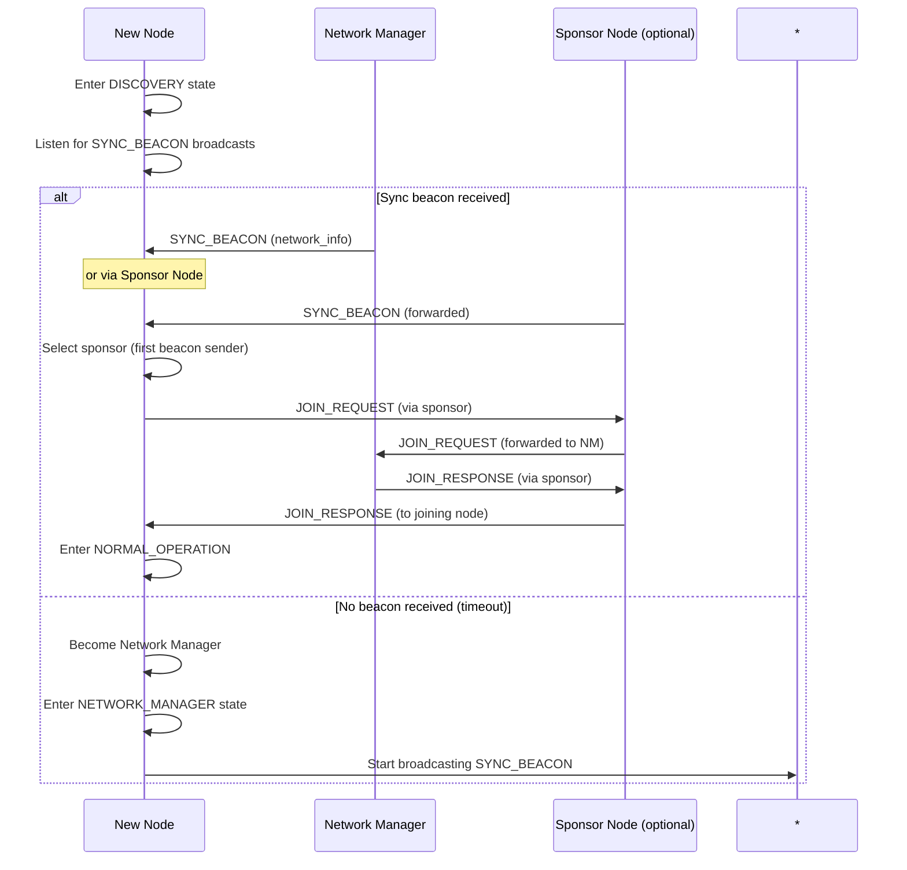

#### 6.1.1 Discovery Timeout Jitter

When multiple nodes start simultaneously (within a few seconds), they would all enter DISCOVERY state and timeout at the same time, each creating their own network. To prevent this race condition, the discovery timeout includes **random jitter** based on the node address.

**Jitter Mechanism**:
- Base discovery timeout: `total_slots × slot_duration_ms × 3` (typically ~30 seconds)
- Maximum jitter: `discovery_jitter_max_ms` (default: 5000ms)
- Jitter calculation: Seeded by node address for deterministic behavior per node

**Effect**:
- Different nodes timeout at different times (spread over 5 seconds)
- First node to timeout becomes Network Manager and starts beaconing
- Other nodes receive the beacon before their timeout and join instead of creating new networks

**Configuration**: The jitter can be configured via `SuperframeService::SetDiscoveryJitter(uint32_t max_jitter_ms)`. Set to 0 to disable jitter (not recommended for production).

#### 6.1.2 Node Role Configuration

For deterministic network formation, nodes can be explicitly configured with one of three roles:

| Role | Enum Value | Behavior |
|------|------------|----------|
| **AUTO** | 0 | Default. Create network if discovery times out (existing behavior) |
| **NETWORK_MANAGER** | 1 | Immediately create network, skip discovery wait |
| **NODE_ONLY** | 2 | Never create network, wait indefinitely to join |

**Use Cases**:
- **Testing**: Designate one node as NETWORK_MANAGER and others as NODE_ONLY to ensure deterministic network formation
- **Production**: Use AUTO for most deployments; use explicit roles when network topology is known in advance
- **Fixed infrastructure**: Use NETWORK_MANAGER for gateway nodes that should always be the network coordinator

**Configuration**:
```cpp
LoRaMeshProtocolConfig config(node_address);
config.setNodeRole(NodeRole::NETWORK_MANAGER);  // or NODE_ONLY, or AUTO
```

**NODE_ONLY Behavior**: Nodes with NODE_ONLY role will remain in DISCOVERY state indefinitely until a SYNC_BEACON is received. They will never call `CreateNetwork()` regardless of discovery timeout.

**NETWORK_MANAGER Behavior**: Nodes with NETWORK_MANAGER role will skip the discovery phase entirely and immediately create a new network, entering the NETWORK_MANAGER protocol state. If a NETWORK_MANAGER-role node later re-enters DISCOVERY after yielding in an NM election, it does not re-create a network on discovery timeout — it remains in DISCOVERY until a SYNC_BEACON is received, similar to NODE_ONLY behavior.

### 6.2 Discovery Messages

> **Note**: Dedicated DISCOVERY_REQUEST and DISCOVERY_RESPONSE message types are planned but not yet implemented. See Section 10 (Future Work) for the planned discovery protocol with explicit message types.

**Current Implementation**: Network discovery relies on receiving SYNC_BEACON messages (0x46) from existing networks. The sync beacon provides network information (network_id, total_slots, network_manager) needed to initiate the join process.

### 6.3 Join Process

#### 6.3.0 Join Request Flow with Superframe Coordination

The following sequence diagram illustrates the coordinated join process. The Network Manager can buffer up to 3 join requests per superframe and applies them atomically at the superframe boundary.

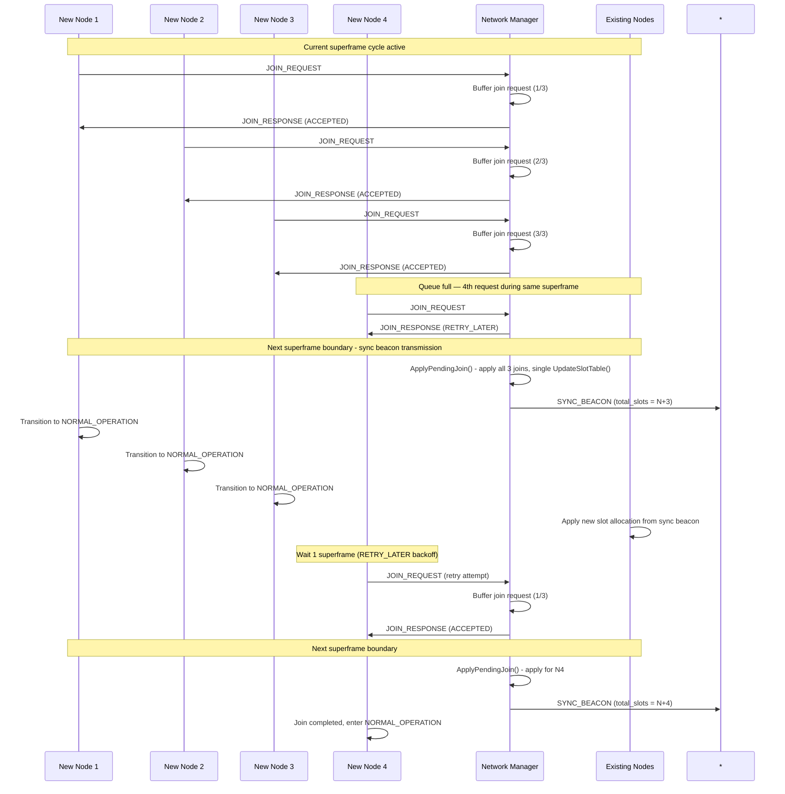

#### 6.3.1 Join Request Handling with Superframe Coordination

The protocol implements a coordinated join process to ensure network stability and proper synchronization. Up to 3 nodes can join per superframe cycle; additional requests receive `RETRY_LATER`. All accepted joins are applied atomically at the superframe boundary with a single slot table rebuild.

**Join Request Buffering Process**:

```cpp
void ProcessJoinRequest(const JoinRequest& request) {
    // Validate request
    if (!validateJoinRequest(request)) {
        sendJoinResponse(request.nodeId, JOIN_DENIED, "Invalid request");
        return;
    }
    
    // Deduplicate by source address
    for (const auto& pending : pending_joins_) {
        if (pending.GetSource() == request.nodeId) return;  // Already pending
    }
    
    // If queue is full, tell the node to retry next superframe
    if (pending_joins_.size() >= kMaxPendingJoins) {
        sendJoinResponse(request.nodeId, RETRY_LATER);
        return;
    }
    
    // Check available slots (accounting for already-pending joins)
    if (!ShouldAcceptJoin(request, pending_joins_.size(), pending_slot_count)) {
        sendJoinResponse(request.nodeId, JOIN_DENIED, "No slots available");
        return;
    }
    
    // Buffer the join request for next superframe boundary
    pending_joins_.push_back(request);
    
    // Send immediate acceptance response
    sendJoinResponse(request.nodeId, JOIN_ACCEPTED, allocatedSlot);
}
```

**Superframe Boundary Processing**:

At the start of each superframe, during sync beacon transmission:

```cpp
void ApplyPendingJoin() {
    if (pending_joins_.empty()) return;
    
    // Re-establish routes for all pending joins
    for (const auto& pending : pending_joins_) {
        addNodeToNetwork(pending.nodeId, pending.requestedSlots);
    }
    
    // Single slot table rebuild for all joins
    UpdateSlotTable();
    
    pending_joins_.clear();
}
```

#### 6.3.2 Join Response Processing

```cpp
void ProcessJoinResponse(const JoinResponse& response) {
    switch (response.status) {
        case JOIN_ACCEPTED:
            // Join successful - wait for superframe update via sync beacon
            assignedSlot = response.assignedSlot;
            networkId = response.networkId;
            synchronizeTime(response.superframeTime);
            
            // Wait for next sync beacon with updated slot allocation
            changeState(JOINING_PENDING);
            break;
            
        case RETRY_LATER:
            // Temporary rejection - schedule retry
            uint32_t retry_delay = config_.retry_delay_superframes * GetSuperframeDuration();
            scheduleJoinRetry(retry_delay);
            logEvent("Join temporarily rejected, retrying in " + 
                    std::to_string(retry_delay) + "ms");
            break;
            
        case JOIN_DENIED:
            // Permanent rejection - return to discovery
            logEvent("Join denied: network full or invalid request");
            changeState(DISCOVERY);
            break;
    }
}

void ProcessSyncBeacon(const SyncBeaconHeader& beacon) {
    // Normal sync beacon processing
    synchronizeTime(beacon);
    
    // If waiting for join completion, check for slot allocation update
    if (current_state == JOINING_PENDING) {
        if (beacon.total_slots_ > previous_total_slots_) {
            // Slot allocation updated - join complete
            changeState(NORMAL_OPERATION);
            startSlotScheduler();
            LOG_INFO("Join completed, transitioning to normal operation");
        }
    }
    
    previous_total_slots_ = beacon.total_slots_;
}
```

#### 6.3.3 RETRY_LATER Behavior and Join Backoff

When the Network Manager receives a join request while the pending join queue is full (3 requests buffered), it responds with `RETRY_LATER`. This tells the joining node to try again in a future superframe.

**Exponential Backoff at Superframe Boundaries:**

Join retries use binary exponential backoff measured in superframes. At each superframe start while in JOINING state:

1. If `join_backoff_remaining > 0`: decrement and skip this superframe
2. Otherwise: send the join request and compute a random backoff:
   - `max_backoff = min(2^min(retry_count, 4), 16)` superframes
   - `backoff = RTOS::GetRandom() % (max_backoff + 1)`

This ensures that multiple nodes competing to join will naturally desynchronize their retries, preventing persistent collisions. Combined with the `RANDOM` subslot assignment strategy (Slotted ALOHA), each retry attempt also picks a different subslot within the discovery slot, further reducing collision probability.

**Example progression:**
| Retry # | Max Backoff (superframes) |
|---------|--------------------------|
| 0       | 1                        |
| 1       | 2                        |
| 2+      | 4                        |

When a node receives `RETRY_LATER` (its message was delivered but NM is busy), the retry counter resets to 0 and backoff is set to 1 superframe. This prevents over-backing-off when the collision was at the NM scheduling level rather than the radio level.

### 6.4 Sponsor-Based Join Protocol

**Overview**: Sponsor-based joining enables nodes beyond direct Network Manager range to join through intermediate sponsor nodes, significantly expanding network reach and reliability.

#### 6.4.1 Sponsor Selection Algorithm

**Sponsor Selection Criteria**:
1. **First Sync Beacon Sender**: Joining node selects the first node from which it receives a sync beacon as its sponsor
2. **Signal Quality**: Only nodes with sufficient signal quality (configurable threshold) are considered
3. **Network Membership**: Sponsor must already be a member of the target network

**Selection Process**:
```cpp
void SelectSponsor(AddressType beacon_sender) {
    if (selected_sponsor_ == 0 && GetSignalQuality(beacon_sender) >= MIN_SPONSOR_QUALITY) {
        selected_sponsor_ = beacon_sender;
        LOG_INFO("Selected sponsor node 0x%04X from first sync beacon received",
                 selected_sponsor_);
    }
}
```

#### 6.4.2 Sponsor-Based Join Sequence

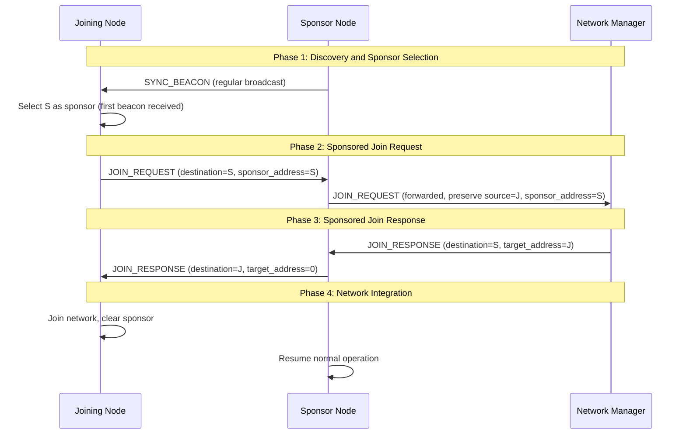

#### 6.4.3 Message Routing Semantics

**Key Routing Distinctions**:
- **destination**: Immediate next hop for message routing
- **target_address**: Final recipient for end-to-end delivery
- **sponsor_address**: Intermediate node facilitating join

**Join Request Routing**:
```cpp
// Joining node creates request
JOIN_REQUEST msg = {
    .destination = selected_sponsor_,     // Route to sponsor first
    .source = node_address_,              // Original requester
    .sponsor_address = selected_sponsor_  // Sponsor identification
};

// Sponsor forwards to Network Manager
JOIN_REQUEST forwarded = {
    .destination = network_manager_,      // Route to NM
    .source = msg.source,                 // Preserve original source
    .sponsor_address = msg.sponsor_address // Preserve sponsor info
};
```

**Join Response Routing**:
```cpp
// Network Manager responds via sponsor
JOIN_RESPONSE response = {
    .destination = sponsor_address,       // Route to sponsor
    .source = network_manager_,           // Response from NM
    .target_address = joining_node        // Final recipient
};

// Sponsor forwards to joining node
JOIN_RESPONSE final = {
    .destination = target_address,        // Route to joining node
    .source = response.source,            // Preserve NM source
    .target_address = 0                   // Clear sponsor info
};
```

#### 6.4.4 Special Cases and Error Handling

**Network Manager as Sponsor**:
When the Network Manager is also the sponsor (sponsor_address == node_address_):
```cpp
if (sponsor_address == node_address_) {
    // Direct routing - we ARE the sponsor
    response_destination = joining_node;
    target_address = 0;  // No forwarding needed
} else {
    // External sponsor - route via sponsor
    response_destination = sponsor_address;
    target_address = joining_node;
}
```

**Sponsor Failure Recovery**:
- If sponsor becomes unreachable, joining node returns to DISCOVERY state
- Clear sponsor selection and restart discovery process

**Forwarding Delivery Mechanism**:
Forwarded join requests and responses are queued to DISCOVERY_TX and delivered via the DISCOVERY_RX fallback TX path. Slot conversion (`ScheduleDiscoverySlotForwarding`) is attempted as an optimization but is not required — the DISCOVERY_RX fallback ensures delivery regardless. Messages that do not fit within the current slot's remaining time are re-queued for the next slot attempt.

**Circular Routing Prevention**:
- Network Manager detects when it is both sender and sponsor
- Direct routing bypasses sponsor mechanism in this case
- Prevents infinite routing loops

#### 6.4.5 Benefits and Applications

**Network Expansion**:
- Enables nodes beyond direct Network Manager range to join
- Creates more robust network topologies
- Reduces dependency on central Network Manager proximity

**Reliability Improvements**:
- Multiple potential sponsors increase join success rates
- Sponsor-based forwarding provides redundant paths
- Graceful fallback to discovery on sponsor failure

**Scalability Enhancement**:
- Distributes join processing load across sponsor nodes
- Enables hierarchical network formation
- Supports larger geographic coverage areas

---

### 6.5 Network Merging

When two independently formed networks come within radio range of each other, the "lite merge"
mechanism automatically merges them into a single network governed by the lower-priority NM.

#### 6.5.1 Mechanism

The merge reuses the existing NM_ELECTION / NM_CLAIM machinery:

| Step | Actor | Action |
|------|-------|--------|
| 1 | Both NMs | Detect a foreign-network SYNC_BEACON (`beacon_network_id ≠ network_id_`) |
| 2 | Both NMs | `HandleForeignBeacon()` → broadcast `NM_CLAIM` with own `election_priority_` |
| 3 | Higher-priority NM | Receives lower-priority claim → yields: enter `DISCOVERY`, stop broadcasting |
| 4 | Lower-priority NM | Receives higher-priority claim → do nothing (wins, remote will surrender) |
| 5 | Yielding NM | Hears winner's `SYNC_BEACON` in `DISCOVERY` state → `StartJoining()` → joins |
| 6 | Yielding NM's nodes | Miss 5 sync beacons → `FAULT_RECOVERY` → `DISCOVERY` → join winner's network |

**Priority rule** (`ComputeElectionPriority()`):
- `NETWORK_MANAGER` role: base 0–63 (always wins against `AUTO`)
- `AUTO` role: base 64–191
- Within the same role, lower address → lower priority value → wins

#### 6.5.2 Implementation

Three changes in `network_service.cpp`:

1. **`ProcessSyncBeacon()`** — NETWORK_MANAGER state: detects foreign beacon and calls
   `HandleForeignBeacon()`. NORMAL_OPERATION/JOINING: silently drops foreign beacons
   without overwriting `network_id_`.

2. **`HandleForeignBeacon()`** — new private method: logs detection and calls `SendNMClaim()`
   to queue an NM_CLAIM in the DISCOVERY_TX slot queue (sent via the DISCOVERY_RX fallback path).

3. **`ProcessNMClaim()`** — NETWORK_MANAGER branch: if incoming priority is lower (wins), the
   node yields by entering DISCOVERY state directly (bypassing the NETWORK_MANAGER role guard
   in `StartDiscovery()` that would otherwise re-create the network immediately).

`CreateNetwork()` always initialises `election_priority_` via `ComputeElectionPriority()` so
nodes configured with `NETWORK_MANAGER` role participate correctly in priority comparisons
even if they never went through `StartElectionBackoff()`.

#### 6.5.3 Known Limitations

**Path A is a best-effort merge suitable for static networks with overlapping edge nodes.**
The following scenarios require Path B (full merge protocol with `FOREIGN_DISCOVERY_RX` slots):

1. **Interior nodes** — secondary nodes that cannot hear the primary NM directly will end up
   in `FAULT_RECOVERY` and may create a new orphan network if no bridge node relays timing.
   Mitigation: enable links so all secondary nodes can reach the primary NM directly.

2. **TDMA misalignment** — detection is opportunistic: one NM's `SYNC_BEACON_TX` (slot 0)
   must land in the other NM's `CONTROL_RX` or `DISCOVERY_RX` slot. Expected wait: 3–10
   superframe durations (~48–160 s @ 1 s/slot × 16 slots). No periodic scan window exists.

3. **Repeated proximity** — if networks drift in/out of range frequently, the merge loop
   repeats, which is functionally correct but generates burst NM_CLAIM traffic.

---

## 7. Packet Structure

### 7.1 Physical Layer Frame

```
┌─────────────────────────────────────────────────────────────────┐
│                        LoRa PHY Header                         │
├─────────────────────────────────────────────────────────────────┤
│                     LoRaMesher Frame                           │
├─────────────────────────────────────────────────────────────────┤
│                        LoRa PHY CRC                            │
└─────────────────────────────────────────────────────────────────┘
```

### 7.2 LoRaMesher Frame Structure

The base header structure used by all messages:

```
 0                   1                   2                   3
 0 1 2 3 4 5 6 7 8 9 0 1 2 3 4 5 6 7 8 9 0 1 2 3 4 5 6 7 8 9 0 1
├─┼─┼─┼─┼─┼─┼─┼─┼─┼─┼─┼─┼─┼─┼─┼─┼─┼─┼─┼─┼─┼─┼─┼─┼─┼─┼─┼─┼─┼─┼─┼─┤
│         Destination Node          │          Source Node          │
├─┼─┼─┼─┼─┼─┼─┼─┼─┼─┼─┼─┼─┼─┼─┼─┼─┼─┼─┼─┼─┼─┼─┼─┼─┼─┼─┼─┼─┼─┼─┼─┤
│   Message Type  │  Payload Size   │       [Message-Specific       │
├─┼─┼─┼─┼─┼─┼─┼─┼─┼─┼─┼─┼─┼─┼─┼─┼─┼─┼─┼─┼─┼─┼─┼─┼─┼─┼─┼─┼─┼─┼─┼─┤
│                   Fields and Payload...]                          │
└─┼─┼─┼─┼─┼─┼─┼─┼─┼─┼─┼─┼─┼─┼─┼─┼─┼─┼─┼─┼─┼─┼─┼─┼─┼─┼─┼─┼─┼─┼─┼─┘
```

### 7.3 Header Field Descriptions

**BaseHeader (6 bytes)** - Common to all message types:

| Field | Size | Description |
|-------|------|-------------|
| Destination Node | 16 bits | Target node identifier (0xFFFF for broadcast) |
| Source Node | 16 bits | Originating node identifier |
| Message Type | 8 bits | Message category and subtype (see Section 3.2) |
| Payload Size | 8 bits | Length of message-specific fields + payload |

**Message-Specific Extensions** - Added after BaseHeader:

| Message Type | Additional Fields | Total Size |
|--------------|-------------------|------------|
| SYNC_BEACON | network_id(2), total_slots(1), slot_duration_ms(2), network_manager(2), hop_count(1), propagation_delay_ms(4), max_hops(1), node_count(1) | 20 bytes |
| JOIN_REQUEST | battery_level(1), requested_slots(1), next_hop(2), sponsor_address(2), hop_count(1) | 13 bytes |
| JOIN_RESPONSE | network_id(2), allocated_slots(1), status(1), next_hop(2), target_address(2), control_slot_index(1) | 15 bytes |
| ROUTE_TABLE | network_manager(2), table_version(1), entry_count(1), source_capabilities(1), source_allocated_slots(1) + entries(10 each) | 12+ bytes |
| DATA | next_hop(2), ttl(1), seq_num(1) + payload | 10+ bytes |
| DATA_BROADCAST | next_hop=0xFFFF(2), ttl(1), seq_num(1) + payload | 10+ bytes |
| NM_CLAIM | election_priority(1), battery_level(1), network_node_count(1), network_id(2) | 11 bytes |
| SLOT_REQUEST | requested_slots(1) | 7 bytes |
| SLOT_ALLOCATION | network_id(2), allocated_slots(1), total_nodes(1) | 10 bytes |

> **Note**: The BaseHeader is 6 bytes (dest, src, type, payload_size). TTL and Sequence Number are implemented in the DataHeader extension (for DATA and DATA_BROADCAST messages) for loop prevention and de-duplication. Flags and Checksum fields are not implemented.

### 7.4 Maximum Frame Sizes

| LoRa Configuration | Max Frame Size | Sync Beacon Size | Data Message Size |
|-------------------|----------------|------------------|-------------------|
| SF7, BW125, CR4/5 | 255 bytes | 20 bytes | 249 bytes |
| SF8, BW125, CR4/5 | 255 bytes | 20 bytes | 249 bytes |
| SF9, BW125, CR4/5 | 255 bytes | 20 bytes | 249 bytes |
| SF10, BW125, CR4/5 | 255 bytes | 20 bytes | 249 bytes |
| SF11, BW125, CR4/5 | 255 bytes | 20 bytes | 249 bytes |
| SF12, BW125, CR4/5 | 255 bytes | 20 bytes | 249 bytes |

*Note: BaseHeader overhead is 6 bytes. Sync beacons are 20 bytes total (6 base + 14 sync-specific). Maximum data payload is 251 bytes (255 max payload - 4 data header extension).*

---

## 8. Error Handling

### 8.1 Error Classification

#### 8.1.1 Protocol Errors
- **Invalid Message Type**: Unknown or corrupted message type
- **Checksum Failure**: Message integrity check failed
- **Timeout Errors**: Expected responses not received
- **State Violations**: Invalid state transitions

#### 8.1.2 Network Errors
- **Route Unavailable**: No path to destination
- **Network Partition**: Network split detected
- **Synchronization Loss**: TDMA timing lost
- **Slot Conflicts**: Multiple nodes using same slot

#### 8.1.3 Hardware Errors
- **Radio Failure**: LoRa module not responding
- **Transmission Failure**: Message send failed
- **Reception Corruption**: Received message corrupted
- **Resource Exhaustion**: Memory or buffer overflow

### 8.2 Error Recovery Mechanisms

The implementation uses a **Result-based error handling system** with the `LoraMesherErrorCode` enum.

#### 8.2.1 Error Code System (Actual Implementation)
```cpp
// From types/error_codes/loramesher_error_codes.hpp
enum class LoraMesherErrorCode {
    kSuccess = 0,
    kUnknownError,
    kConfigurationError,
    kTransmissionError,
    kReceptionError,
    kInvalidState,
    kHardwareError,
    kTimeout,
    kInvalidParameter,
    kBufferOverflow,
    kNotInitialized,
    kCrcError,
    kPreambleError,
    kSyncWordError,
    kFrequencyError,
    kCalibrationError,
    kMemoryError,
    kBusyError,
    kInterruptError,
    kModulationError,
    kInvalidArgument,
    kNotImplemented,
    kSerializationError
};

// Result class usage
Result SendMessage(const BaseMessage& message);  // Returns Result with error code
if (!result.IsSuccess()) {
    auto error = result.getErrorCode();
    // Handle specific error...
}
```

#### 8.2.2 Route Recovery (Actual Implementation)

Route recovery is handled through the routing table's inactive node removal:

```cpp
// From protocols/lora_mesh/routing/distance_vector_routing_table.cpp
size_t RemoveInactiveNodes(uint32_t current_time,
                           uint32_t route_timeout_ms,
                           uint32_t node_timeout_ms) {
    // Mark routes as inactive if they've timed out
    for (auto& node : nodes_) {
        if (node.IsExpired(current_time, route_timeout_ms) && node.is_active) {
            node.is_active = false;
            NotifyRouteUpdate(false, node.routing_entry.destination, 0, 0);
        }
    }

    // Remove nodes that have been inactive for too long
    // ... node removal logic
}
```

#### 8.2.3 Network Recovery (Actual Implementation)

Network recovery uses state machine transitions:

```cpp
// State-based recovery via SetState()
void SetState(ProtocolState state);

// Synchronization management
void SetSynchronized(bool synchronized);
void PerformTimingSynchronization();

// Network state reset
void ResetNetworkState();
```

Recovery flow when sync is lost:
1. Node detects sync beacon timeout
2. After 2 missed beacons: expands all sync beacon slots to SYNC_BEACON_RX (may recover here)
3. After 5 missed beacons: transitions to `FAULT_RECOVERY` state
4. Clears stale routing information via `RemoveInactiveNodes()`
5. Resets synchronization state
6. Returns to `DISCOVERY` state to rejoin network


---

## 9. Performance Characteristics

### 9.1 Timing Requirements

| Parameter | Minimum | Typical | Maximum | Units |
|-----------|---------|---------|---------|-------|
| Slot Duration | 500 | auto-calculated | 5000 | ms |
| Superframe Duration | 4000 | 8000 | 40000 | ms |
| Route Update Interval | 5000 | 10000 | 30000 | ms |
| Join Timeout | 5000 | 10000 | 30000 | ms |
| Sync Tolerance | 50 | 100 | 500 | ms |

### 9.2 Scalability Limits

| Parameter | Current Limit | Design Limit | Notes |
|-----------|---------------|--------------|-------|
| Network Size | 50 nodes | 65535 nodes | Limited by 16-bit node IDs |
| Slots per Superframe | configurable | 255 | Configurable via SuperframeConfig |
| Routes per Node | 40 | 255 | Memory-dependent (std::array size) |
| Message Queue Depth | 10 | 255 | Per-slot queue |
| Hop Count Limit | 10 | 255 | Prevents routing loops |

### 9.3 LoRa Air Time Calculations

| Frame Size | SF7 | SF8 | SF9 | SF10 | SF11 | SF12 |
|------------|-----|-----|-----|------|------|------|
| 20 bytes (Sync Beacon) | 25ms | 46ms | 82ms | 164ms | 329ms | 658ms |
| 50 bytes | 51ms | 103ms | 185ms | 371ms | 741ms | 1.4s |
| 100 bytes | 82ms | 144ms | 267ms | 535ms | 1.0s | 2.1s |
| 200 bytes | 144ms | 267ms | 493ms | 989ms | 1.9s | 3.9s |
| 255 bytes | 185ms | 329ms | 616ms | 1.2s | 2.4s | 4.9s |

*Calculated for BW=125kHz, CR=4/5, with 8-byte preamble. Optimized sync beacons significantly reduce air time and power consumption.*

### 9.4 Memory Usage

#### 9.4.1 Static Memory (per node)
- **Protocol State**: ~100 bytes
- **Configuration**: ~200 bytes  
- **Service Objects**: ~500 bytes
- **Total Static**: ~800 bytes

#### 9.4.2 Dynamic Memory (per node)
- **Routing Table**: ~50 routes × ~24 bytes (in-memory with link stats) = ~1.2KB
- **Message Queues**: ~10 messages × 255 bytes = 2.5KB
- **Network State**: ~300 bytes
- **Total Dynamic**: ~4KB (approximate, depends on configuration)

#### 9.4.3 Total Memory Footprint
- **ESP32 Usage**: Fits comfortably within ESP32's 520KB SRAM
- **Acceptable for**: ESP32 with >100KB RAM available

---

## 10. Future Work and Research Directions

### 10.1 Open Research Questions

#### 10.1.1 Join Message Forwarding
**Problem**: Evaluate how join_request and join_response should be forwarded through the network. Multiple devices would receive the message and we need to ensure that only one message is forwarded.

**Research Direction**: 
- Use next_hop when joining a network to prevent duplicate forwarding
- Implement forwarding priority based on link quality or hop count
- Develop collision detection mechanisms for join message forwarding

#### 10.1.2 Superframe Initiation Timing
**Problem**: Evaluate how the superframe is being started when a sync beacon is received.

**Research Direction**:
- Analyze timing accuracy requirements for superframe alignment
- Develop adaptive timing correction algorithms
- Study impact of propagation delay on superframe synchronization

### 10.2 Implementation and Testing Requirements

#### 10.2.1 Critical Testing Needs
- **Collision Mitigation Testing**: Test the collision mitigation in a separate test to ensure this works, as it is a really critical part of the code
- **Multi-Node Network Simulation**: Validate protocol behavior in 2-50 node networks
- **Real-World Deployment**: Field testing in various environmental conditions

#### 10.2.2 Regulatory Compliance
- **Duty Cycle Configuration**: Ensure regulations compliance with configurable duty cycle limits
- **Power Output Control**: Adaptive power control to meet regional regulations
- **Frequency Management**: Dynamic frequency selection within ISM bands

### 10.3 System Architecture Evolution

#### 10.3.1 Service Decomposition
**Problem**: Separate network_service.cpp into different files. 

**Research Direction**:
- **Superframe Service**: Slot allocations inside the superframe_service
- **Routing Service**: Distance-vector routing logic separation
- **Join Management Service**: Dedicated service for network joining
- **Power Management Service**: Battery-aware scheduling and power optimization

#### 10.3.2 Advanced Power Management
- **Battery-Aware Scheduling**: Dynamic slot allocation based on battery levels
- **Network-Wide Power Optimization**: Coordinated power saving across all nodes
- **Emergency Wake-Up Protocols**: Critical message delivery during sleep periods

### 10.4 Protocol Extensions

#### 10.4.1 Security Enhancements
- **Message Authentication**: Cryptographic message integrity
- **Key Distribution**: Secure key exchange mechanisms
- **Network Access Control**: Authentication for network joining

#### 10.4.2 Quality of Service
- **Priority-Based Routing**: Different service levels for message types
- **Bandwidth Allocation**: Guaranteed bandwidth for critical applications
- **Latency Optimization**: Real-time message delivery guarantees

#### 10.4.3 Scalability Improvements
- **Hierarchical Network Management**: Multiple network managers for large networks
- **Network Clustering**: Logical network partitioning for improved scalability
- **Inter-Network Communication**: Bridge protocols between multiple mesh networks

### 10.5 Performance Optimization

#### 10.5.1 Adaptive Algorithms
- **Dynamic Slot Allocation**: Real-time adjustment based on traffic patterns
- **Intelligent Route Selection**: Machine learning for optimal path selection
- **Predictive Maintenance**: Proactive detection of network issues

#### 10.5.2 Energy Efficiency Research
- **Ultra-Low Power Modes**: Sub-milliwatt sleep states
- **Energy Harvesting Integration**: Solar/RF energy harvesting support
- **Lifetime Prediction**: Battery life estimation and optimization

### 10.6 Planned Message Types and Protocols

This section documents message types and protocols that are specified but not yet implemented.

#### 10.6.1 Data Message Extensions

**DATA_BROADCAST (0x12)** — **Implemented**: Network-wide broadcast using TTL-based controlled flooding.
- Broadcast addressing uses destination `0xFFFF`
- Each node delivers to application layer AND forwards with TTL-1
- Loop prevention via TTL field (default 10) and per-source sequence number
- De-duplication: unified 32-entry circular cache shared with unicast DATA messages
- API: `LoraMesher::SendBroadcast(std::span<const uint8_t>)`
- See Section 3.2.6 for wire format details

**DATA_MULTICAST (0x13)** — **Planned**: Group-based messaging where messages are delivered to a subset of nodes subscribed to a multicast group. Requires a group membership protocol (join/leave groups) not yet designed.

#### 10.6.2 HELLO Message Protocol
```cpp
// Planned neighbor discovery message
HELLO = 0x31,  // Hello packet for neighbor discovery (reserved)

struct HelloMessage {
    // Standard message header (6 bytes)
    AddressType destination;     // Broadcast or target (2 bytes)
    AddressType source;          // Sending node address (2 bytes)
    MessageType type = HELLO;    // Message type 0x31 (1 byte)
    uint8_t payload_size;        // Size of hello payload (1 byte)

    // Hello-specific fields
    uint32_t timestamp;          // Transmission timestamp (4 bytes)
    uint8_t sequence_number;     // Message sequence for tracking (1 byte)
    uint8_t link_quality;        // Local link quality assessment (1 byte)
};
```

**Purpose**: HELLO messages will enable neighbor discovery and link quality assessment separate from routing table updates.

#### 10.6.3 Discovery Message Protocol
```cpp
// Planned discovery messages (proposed codes)
DISCOVERY_REQUEST = 0x47,   // Explicit network discovery request (planned)
DISCOVERY_RESPONSE = 0x48,  // Response with network information (planned)

struct DiscoveryRequest {
    uint8_t messageType;     // DISCOVERY_REQUEST (0x47)
    uint16_t nodeId;         // Discovering node ID
    uint8_t capabilities;    // Node capabilities
    uint8_t preferredRole;   // Preferred network role
    uint8_t maxHops;         // Maximum network diameter
    uint8_t checksum;        // Message integrity
};

struct DiscoveryResponse {
    uint8_t messageType;     // DISCOVERY_RESPONSE (0x48)
    uint16_t managerId;      // Network manager ID
    uint16_t networkId;      // Network identifier
    uint8_t networkSize;     // Number of active nodes
    uint8_t availableSlots;  // Number of free slots
    uint8_t networkQuality;  // Overall network quality
    uint32_t uptime;         // Network uptime
    uint8_t checksum;        // Message integrity
};
```

**Purpose**: Explicit discovery messages will allow nodes to actively query for available networks instead of passively waiting for sync beacons.

**Note**: Original type code 0x24 was reassigned because it conflicts with PONG (0x24). The proposed code 0x47 for DISCOVERY_REQUEST also conflicts with NM_CLAIM (0x47, now implemented). New type codes must be allocated if this protocol is implemented.

#### 10.6.4 Network Manager Election Protocol

`NM_CLAIM = 0x47` is now implemented (see Section 5.9 and Section 3.2.5). No further election messages are planned.

#### 10.6.5 Configuration Parameters

`min_sleep_fraction` (default 30%) is **implemented**. It ensures a minimum percentage of superframe slots are reserved for sleep. Configured via `config.setMinSleepFraction(0.30f)` (range 0.0–0.9).

`link_quality_ewma_alpha` (default 0.30) is **implemented**. EWMA smoothing factor for link quality tracking. Higher values make quality respond faster to changes. Configured via `config.setLinkQualityEwmaAlpha(0.30f)` (range 0.05–0.95).

`consecutive_missed_for_inactivation` (default 10) is **implemented**. Number of consecutive superframes without a routing message before a direct neighbor is marked inactive. Configured via `config.setConsecutiveMissedForInactivation(10)` (range 4–30).

`min_consecutive_for_reactivation` (default 2) is **implemented**. Number of consecutive routing message receptions required before an inactive route is re-activated (hysteresis). Configured via `config.setMinConsecutiveForReactivation(2)` (range 1–10).

```cpp
// Remaining planned additions
uint32_t sync_tolerance_ms;    // Acceptable sync drift (ms) — not yet implemented
```

**Purpose**: These parameters will enable fine-grained control over synchronization accuracy and power management.

#### 10.6.6 Frame Header Extensions

TTL and sequence number are now implemented in the DataHeader extension (see Section 3.2.6) for DATA and DATA_BROADCAST messages. Remaining planned additions to the BaseHeader:

```cpp
// Remaining planned fields
uint8_t flags;           // Protocol flags (ACK required, priority, etc.)
uint8_t checksum;        // XOR checksum of entire frame
```

#### 10.6.7 Routing Algorithm Enhancements

**Weighted Cost Metric** (Implemented):

A composite cost formula combining hop count and link quality has been implemented.
See Section 4.1 for details on the `CalculateRouteCost()` function and `IsBetterRouteThan()` method.

**EWMA Link Quality and Re-activation Hysteresis** (Implemented):

EWMA-based link quality tracking and hysteresis-based re-activation are implemented.
See Section 4.3 for details on EWMA quality calculation, multi-hop quality capping, and the `recovery_counter` mechanism.

**Direct Neighbor Stability Enhancements** (Implemented):

Mitigations for the direct neighbor abandonment cascade (see Section 4.3):

- **Weighted bottleneck quality**: Replaced `min(local, remote)` with `(min × 7 + avg × 3) / 10` for bidirectional links. At local=63, remote=238: result=89 (cost=736) preserves the direct link vs 3-hop (cost=882), while still penalizing true asymmetry
- **Hard unidirectional penalty**: Quality is set to 1 (minimum) when a link is confirmed unidirectional, producing cost=65535 (maximum). This ensures any bidirectional alternative is always preferred

**Explicit Route Poisoning**:
```cpp
// Planned function for route invalidation
void BroadcastRoutePoison(AddressType destination) {
    RoutingTableEntry poison_entry;
    poison_entry.destination = destination;
    poison_entry.hop_count = 255;      // INFINITE_HOPS
    poison_entry.link_quality = 0;
    BroadcastRoutingUpdate(poison_entry);
}
```

**True Split Horizon**:
```cpp
// Planned: Filter by next_hop instead of destination
std::vector<RoutingTableEntry> GetRoutingEntriesWithSplitHorizon(
    AddressType target_node) const {
    std::vector<RoutingTableEntry> entries;
    for (const auto& node : nodes_) {
        if (node.is_active && node.next_hop != target_node) {
            entries.push_back(node.ToRoutingTableEntry());
        }
    }
    return entries;
}
```

#### 10.6.8 Fault Recovery Protocol (Planned)

Network partition recovery using explicit route poisoning (ROUTE_POISON messages with infinite metric) and healing beacons (NETWORK_HEALING_BEACON). Currently, partition recovery relies on timeout-based route aging and state machine transitions to FAULT_RECOVERY → DISCOVERY.

---

## 11. Conclusion

The LoRaMesher protocol provides a robust, scalable solution for LoRa mesh networking with the following key features:

### Core Capabilities (Implemented)
- **Distance-Vector Routing**: Link quality-based route selection with timeout-based route aging
- **TDMA Coordination**: Superframe-based slot allocation with deterministic control slot ordering
- **Multi-Hop Synchronization**: Hop-layered sync beacon forwarding with propagation delay compensation
- **Sponsor-Based Joining**: Nodes beyond Network Manager range can join via intermediate sponsor nodes
- **Broadcast Messaging**: TTL-based flooding with de-duplication for network-wide data delivery
- **Loop Prevention**: TTL and sequence numbers in data messages prevent routing loops

### Technical Specifications
- **BaseHeader Size**: 6 bytes (destination, source, type, payload_size)
- **Sync Beacon Size**: 20 bytes total (6 base + 14 sync-specific)
- **Maximum Data Payload**: 251 bytes (255 max payload - 4 data header extension)
- **Route Timeout**: Default 180,000 ms (3 minutes)
- **Memory Footprint**: Designed for resource-constrained MCUs; fits within ESP32's available SRAM

### Implementation Notes
This specification has been synchronized with the actual codebase as of version 1.7. Several features documented in earlier versions are marked as planned in Section 10:

**v1.7 Changelog**:
- **EWMA link quality** (Section 4.3): Uses deferred decay — quality only degrades when a message is actually missed, ensuring perfect reception converges to ~255. Configurable via `setLinkQualityEwmaAlpha()`.
- **Re-activation hysteresis** (Section 4.3): Routes must receive `min_consecutive_for_reactivation` (default 2) consecutive messages before re-activation, preventing oscillation on marginal links.
- **Multi-hop quality capping** (Section 4.3): Multi-hop cascade uses `min()` cap instead of quality halving; EWMA provides smooth degradation.
- **Link quality configuration** (Section 10.6.5): New parameters `link_quality_ewma_alpha`, `consecutive_missed_for_inactivation`, `min_consecutive_for_reactivation`.

**v1.6 Changelog**:
- **NM_ELECTION state** (Section 2.2): New state added; node broadcasts NM_CLAIM and waits for counter-claims before calling `CreateNetwork()`.
- **NM_CLAIM message** (Section 3.2.5): `NM_CLAIM = 0x47` implemented with 5-byte payload carrying `election_priority`, `battery_level`, `network_node_count`, and `network_id`.
- **Network Manager election algorithm** (Section 5.9): Full staggered-backoff election with weighted priority (role + address component). Replaces the "planned but not implemented" placeholder.

**v1.5 Changelog**:
- **Route re-activation fix** (Section 4.3): `UpdateRoute()` no longer overwrites an inactive route with a worse advertisement; the existing (better) route is preserved and the node is simply re-activated. Prevents false `max_hops` inflation that shifted the superframe structure.
- **`GetMaxHopsFromRoutingTable()` fix**: Inactive nodes are now skipped so stale hop counts cannot inflate the NM's `current_network_depth_`.
- **`min_sleep_fraction` configuration** (Section 5.8.2): New parameter (default 30%) guarantees a minimum sleep budget in large dense networks where the TX-duty-cycle formula alone would produce zero sleep slots.
- Frame header fields (Flags, TTL, Sequence Number, Checksum)
- Explicit route poisoning and network healing beacons
- Hop count as primary routing metric
- Explicit discovery request/response messages

The protocol is specifically designed for embedded systems with limited resources while maintaining the flexibility to scale to larger networks.

**Current Status**: Core protocol implemented. See Section 10 for planned enhancements and research directions.